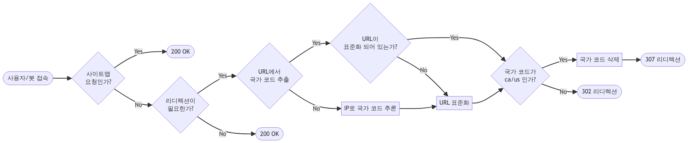
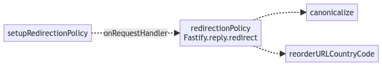
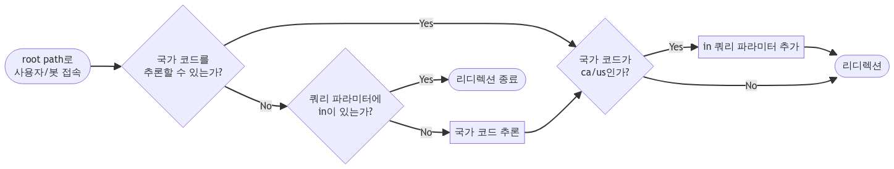
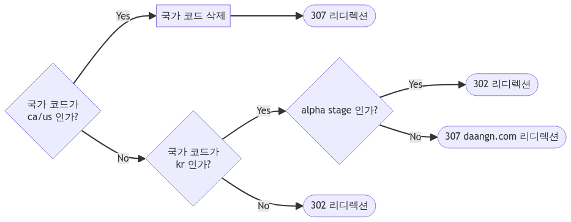

새로운 팀에 합류하게 되면, 이미 운영 중인 서비스의 코드를 다루게 되는 일이 생긴다. 이 서비스의 코드 베이스를 변경하려고 하면 막막한 경우가 발생하곤 한다. 우선, 처음부터 개발에 참여하지 않았으니, 모든 것이 생소할 것이다. 프로젝트 구조부터, 이전 팀의 컨벤션과는 완전히 다르게 작성된 코드, 처음 보는 라이브러리처럼 기술적인 생소함이 있을 것이고, 문맥이나 정책을 이해하지 못했기 때문에 이해할 수 없는 생소함이 있을 것이다.

특히나 더 부담되는 부분은 내가 손대야 하는 "생소한 코드"가 _운영 중인 서비스_ 라는 점이다. 잘 운영되고 있는 서비스의 코드를 수정하는 것은 종종 *달리는 자동차의 바퀴를 갈아 끼우는 일*에 비교된다. 그만큼 어렵고, 신중해야 한다는 뜻이며, 잘못 갈아 끼울 경우 크고 작은 사고가 발생할 수 있다.

최근 간단해 보였지만 한 달 가까이 지속해서 신경 썼던 기능 변경을 마무리했다. 요구 사항은 그리 어렵지 않았지만, 몇 번의 배포 끝에 해결한 문제였고, 그 과정에서 나 자신의 문제점을 인식했다. 그래서 이 기능 변경 과정을 회고하고, 느낀 점을 공유해 보려고 한다.

## 1. 어떠한 변경이었나

당근에서는 글로벌 서비스 확장을 시도하고 있고, 그 시도의 하나로 [karrotmarket.com](https://karrotmarket.com/ca/)이라는 서비스를 운영하고 있다. 이 사이트는 북미(캐나다, 미국)와 일본, 영국에 서비스하고 있고 국가별로 다른 콘텐츠를 보여준다. 그렇기 때문에 URL의 구조나 리디렉션이 정책이 복잡할 수밖에 없다.

내가 맡은 일은, 클라이언트 사이드에서 `window.history.replace`로 동작하던 리디렉션을 서버 사이드로 옮기는 것이었다. 이를 위해 서비스 코드 중에서도 처음 보는 부분들을 주로 다루게 되었고, 동시에 코드를 조금이라도 개선하고 싶다는 욕심 역시 생겼다.

## 2. 개선 과정

### 1. 리디렉션 로직 분석

서버 사이드 리디렉션 로직을 본격적으로 작성하기 전에, [karrotmarket.com](https://karrotmarket.com/ca/) 서비스의 리디렉션 정책부터 분석하기 시작했다. 먼저 정책이 정리된 문서나 작업 이력(티켓)이 남아있는지 살펴보았지만, 정리되어 있는 것이 없었다. 리디렉션 정책을 직접 테스트하는 테스트 코드 역시 없었기 때문에 로직을 살펴볼 수밖에 없었다.

코드를 분석한 결과 리디렉션 정책은 내가 생각했던 것 이상으로 복잡했는데, 맨 처음 파악한 정책은 아래와 같았다.

1. 사이트맵 요청은 리디렉션하지 않는다.
2. 리디렉션이 필요하지 않은 요청은 리디렉션하지 않는다.
   - Ignore path에 등록된 요청은 리디렉션하지 않는다.
   - 표준화(canonicalize)된 URL일 경우 리디렉션하지 않는다.
3. URL에서 국가 코드를 추론할 수 있다면, IP 주소로 국가 코드를 추론하지 않는다.
   - 국가 코드는 서브 도메인이나 URL path에 포함될 수 있다.
   - 만약 서브 도메인에 포함되어 있다면 URL path로 옮긴다.
4. URL에서 국가 코드를 추론할 수 없다면, IP 주소에서 국가 코드를 추론한다.
5. 국가 코드가 ca/us라면 국가 코드를 삭제해 리디렉션 한다.

이를 flowchart로 표현하면 아래와 같다.

<center>
    
</center>

### 2. 로직 분리

처음에는 리디렉션이 클라이언트 사이드에서 이루어지고 있었기 때문에 `root.tsx`[^1]에서 사용할 리디렉션 URL을 서버 사이드에서 만들어서 context로 전달하면 그만이었다. 그렇기 때문에 클라이언트로 전달해야 하는 context를 만드는 `setupRemix`라는 함수에서 context에 대한 모든 것을 처리하고 있었다. 그 "모든 것"에는 리디렉션이 필요한 상황에서 리디렉션 URL을 만드는 로직까지 포함하고 있었다.

다행히 코드가 지역적으로는 분리되어 있지는 않았지만, 논리적으로는 잘 분리되어 있어 리디렉션 URL을 만드는 로직을 잘 추출할 수 있었다.

1. _서브 도메인에 국가 코드가 포함되어 있다면 URL path로 옮긴다_ 는 정책을 만족시키기 위해, `reorderURLCountryCode` 함수를 작성했다.
   - 이 함수는 서브 도메인에 있는 국가 코드를 URL path로 옮기는 역할만 담당한다.
2. 그리고 `redirectionPolicy` 라는 함수를 작성해, 리디렉션을 담당하게 했다.
   - 이미 잘 구현되어 있는 canonicalize 라는 함수를 이용해 요청 URL을 표준화한다.
   - 이 함수는 URL을 분석하여 리디렉션을 할지 말지 결정한 뒤, 필요하다면 리디렉션을 수행한다.
3. `setupRedirectionPolicy`라는 fastify의 onRequest hook에서 `redirectionPolicy`를 호출한다. - `redirectionPolicy`함수에 `Fastify.req`, `Fastify.reply`를 주입하고, 그 외의 동작은 하지 않는다.

추출한 방식에 따라, 의존관계를 표현하자면 아래와 같다.

<center>
    
</center>

기존의 `setupRemix` 함수에서 관련 로직을 분리하고 나니, 생각보다 많은 line을 삭제할 수 있었다. 함수의 크기가 작아지고 특정 영역을 담당하는 로직이 사라져 `setupRemix` 역시 context에만 관여하는 함수로 바뀌어 응집력이 조금 나아졌다.

### 3. 테스트 케이스 작성

이어서, `redirectionPolicy` 함수의 테스트 케이스를 본격적으로 작성했다. UI를 담당하는 컴포넌트의 테스트를 작성하는 것은 크게 선호하지는 않지만, 입력과 출력이 명확한 테스트를 작성하는 것은 큰 의미가 있다는 생각이 들었다. 기능을 구현하며 조건문으로 구현한 부분을 생각나는 대로 채워 넣었다.

그 과정에서 IP를 기반으로 국가를 추론하는 함수를 다시 `getRegionInformation`이라는 함수로 분리했는데, 외부 API를 호출하는 동작이 단위 테스트 대상 로직에 직접 포함되는 것이 적절하지 않다고 판단했기 때문이다. 그래서 `redirectionPolicy` 함수가 `getRegionInformation` 함수의 반환 값을 파라미터로 주입받는 형태로 수정하였다. 테스트 케이스가 문제없이 통과되었고, 해당 변경에 대한 리뷰 역시 약간의 comment와 함께 승인되었다.

해당 변경이 병합된 뒤, 이 로직을 처음 구현한 팀 동료 [토니](https://fromundefined.com)가 리디렉션에 대한 로직을 core 패키지로 옮겨 app 패키지로부터 격리하는 것이 어떻겠냐는 의견을 주었다. core 패키지로 옮기는 과정에서 `redirectionPolicy` 함수가 직접적으로 의존하고 있던 부분들을 느슨하게 의존하도록 만들어줄 수 있었고, 결과적으로 더 쉽게 테스트를 작성할 수 있게 되었다.

배포하고 나서, 잘 동작하고 있는 서비스의 리디렉션 정책을 변경한 것 치고는 생각보다 너무나 쉽다고 생각했었다. 아침 7시에 멘션을 받기 전까지는.

## 3. 반복된 실패

다음날, 새벽 7시에 슬랙 멘션을 받았다. 캐나다 서비스에 접속하면 "알 수 없는 에러가 발생했습니다."라는 에러 메시지가 보인다는 내용이었다. 순간 잠이 확 깼고, 매우 긴급하다고 판단되어 바로 대응하기 시작했다. 문제의 원인은 `https://karrotmarket.com/abcd/` 로 접속한 경우 `https://karrotmarket.com/kr/abcd/`와 같이 한국 서비스 페이지로 접속되는 문제였다.

### 1. 복잡한 로직을 제대로 파악하지 않음

이 문제는 너무 단순하게 _"URL에서 국가 코드를 추론할 수 없다면 IP로 추론한다_"는 정책을 적용시켜 버린 결과였다. 언뜻 보면 문제없이 로직을 작성한 것처럼 보이지만, 위 버그의 경우 _"국가 코드가 ca/us인 경우 국가 코드를 삭제한다"_ 는 정책을 제대로 적용하지 못한 결과였다.

즉, `https://karrotmarket.com/abcd/`는 이미 ca혹은 us라는 국가 코드가 생략된 것이기 때문에 IP로다시 추론할 필요가 없음에도, 이 부분을 로직에서 고려하지 않아 문제가 발생한 것이다. 결국 root path("/")로 접근했을 때, 아무런 국가 코드를 추론할 수 없을 때만 IP로 국가 코드를 추론하도록 수정해 문제를 해결할 수 있었다.

### 2. 코드의 실행 환경을 고려하지 않음

하지만 리디렉션이 서버 사이드에서 동작하자 또 다른 문제가 발생했다. 다른 경로는 큰 문제가 없었지만, 한국에서 북미 서비스(ca/us)의 root path로 접근하면 한국 서비스의 root path로 리디렉션되는 문제였다. 원인을 파악해 보니 아래와 같았다.

1. 한국에서 국가 코드를 ca로 설정하여 root path로 사이트 진입 (karrotmarket.com/ca/)
2. 서버에서는 정책에 따라 국가 코드를 삭제하고 리디렉션 (karrotmarket.com/)
3. 이 트래픽이 다시 서버로 진입했을 때, root path로 접근했지만 아무런 국가 코드를 추론할 수 없기 때문에 IP로 국가 코드를 추론함
4. 결국 접속한 위치인 한국으로 국가 코드가 설정되어 최종 리디렉션됨 (karrotmarket.com/kr/)

그전에는 브라우저에서 리디렉션이 실행되었기 때문에 한 번 리디렉션되면 더 이상 신경 쓸 필요가 없었다. 즉, 서버에서 리디렉션할 URL을 만들어서 클라이언트 사이드로 전달하고, JavaScript가 실행되면서 `window.history.replace`로 URL을 바꿔주는 구조였다. 결국 한 번만 리디렉션 하므로 일단 리디렉션 되었다면 그다음을 신경 쓸 필요가 없었다.

하지만 서버 사이드에서 리디렉션을 하게 되면, 트래픽이 서버로 한 번 더 도달할 가능성이 있기 때문에 이 부분을 고려했어야 했다.

### 3. 초기 정책 파악 실패

이 문제를 해결하기 위해 여러 해결책을 고민했고, 서버로 접속하는 URL의 문맥을 파악할 방법을 찾기 시작했다. 즉, 실제로 사용자가 처음 접속하는 상황인지, 그렇지 않고 리디렉션되는 상황인지 알 수 있다면 이 문제를 해결할 수 있다고 생각했다.

만약 사용자가 root path로 접속했을 때 URL에 아무런 국가 코드 맥락이 없다면, 다음과 같이 처리할 수 있기 때문이다.

- 처음 접속하는 상황이라면 국가코드를 추론한다.
- 리디렉션되는 상황이라면 ca/us로 접속하는 것으로 간주해 아무런 동작도 하지 않고 정상 응답을 보낸다.

그래서 URL의 문맥을 추적할 방법을 고민하게 되었는데, 쿼리 스트링을 이용하면 나중에 다른 팀의 요구 사항과 충돌할 우려가 있고, 쿼리 스트링을 다루는 로직 역시 복잡해질 거라는 의견이 있었다.

결국 쿠키까지 사용하는 과하게 복잡한 로직을 구현하게 되었는데, 코드 리뷰 과정에서 토니에 의해 root path일 때 `in`이라는 쿼리 파라미터가 있는 경우 ca/us로 간주한다는 정책이 있다는 것을 알게 되었다. 즉 아래와 같은 URL은 ca/us 서비스로 간주한다는 것이다.

```
https://karrotmarket.com/?in=toronto-3551
```

이 정책을 알게 된 덕분에 해결책은 매우 간단해졌다. 다음과 같은 흐름을 갖도록 코드를 수정했고, 문제는 완전히 해결되었다.

<center>
    
</center>

위와 같이 구현했더니, root path로 접속할 때 `in`이라는 쿼리 파라미터가 있다면 이미 리디렉션된 것으로 간주할 수 있어 URL의 문맥 추적이 가능해졌다. 또한 `in`이라는 쿼리 파라미터는 여러 팀 사이에서 "지역"을 나타내는 값으로 합의가 되어있었다. 자연스럽게 쿼리 스트링으로 문맥을 추적할 경우, 요구 사항이 충돌해 쿼리 파라미터를 변경해야 할 가능성이 사라졌다.

### 4. 테스트 케이스 맹신

이 작업을 진행하면서 굉장히 부끄러웠던 부분인데, 나도 모르게 복잡한 로직을 대할 때 테스트 케이스에 너무 많은 의존을 하고 있었다는 것을 깨닫게 되었다. 상술했듯, 실행 환경을 고려하지 않고 테스트 케이스를 작성한 탓에 false-negative 문제에서 벗어날 수 없었다.

특히 IP를 기반으로 접속 위치를 추론하는 `getRegionInformation` 함수의 반환 값을 ca/us로만 설정해 테스트 케이스를 작성했기 때문에 문제가 발생했다. 실제로, 특정 케이스의 `getRegionInformation`의 반환 값을 다른 값으로 수정하자 테스트가 바로 실패해 버리기도 했다.

그럼에도, _"이번에는 테스트가 통과했으니 문제없을 거야"_ 라는 생각을 끝까지 버리지 못했다. 테스트 케이스가 있고 팀원들의 리뷰가 통과되었으니 괜찮을 것이라는 안일함이 문제의 원인 중 하나였다. 특히 계속해서 테스트 케이스에서 문제가 발생한다면 팀원들이 테스트 자체를 무의미하게 여기게 될 수 있어, 테스트를 너무 가볍게 여긴 것은 아닌가 반성하게 되었다.

## 4. 앞으로 개선할 점

어쨌든, 문제를 해결하고 스스로 회고를 해보았다. 문제를 빠르게 해결하지 못한 원인을 고민해 보았고, 개선점을 나름 찾으려고 노력했다.

### 1. 선 정책 파악 우선

로직이 복잡한 만큼 코드를 먼저 작성하기보다 기존의 정책을 면밀히 알아보고, 기존 코드를 조금 더 자세히 파악했다면 어땠을까? 실수가 없지는 않았겠지만, 최소한 시간을 덜 소모해 운영팀의 불편함을 해소했을 것이다.

물론 팀마다 나름의 사정이 있으니, 기획이나 정책을 정리한 문서가 없더라도 그렇게 이상한 일은 아니다. 다만 그런 문서가 없거나, 있더라도 최신화되어 있지 않은 것을 발견했을 때 그 부분을 개선하지 않는 것은 이상한 일이라고 생각했다.

그랬기 때문에 이 문제를 해결하고 가장 먼저 한 일은 정책을 정리한 문서를 남기는 것이었다. 팀원들이 리디렉션 관련 로직을 수정할 때 이 문서가 진실의 원천이 될 수 있으니, 구현이나 리뷰하는 입장에서 한결 수월할 것이라 기대하고 있다.

### 2. 거꾸로 하지 않기

정책 문서를 정리하고 보니 불현듯 한가지 생각이 떠올랐다. 먼저 정책을 정리해 테스트 케이스로 옮기고 그 테스트가 통과하도록 로직을 작성했으면 훨씬 수월하지 않았을까?

사실 이 기능을 수정하면서 힘들었던 점 중의 하나는, 운영팀에서 버그를 제보할 때 마다 몰랐던 정책이나 기획이 하나씩 드러났다는 것이다. 당연히 테스트 케이스나 로직은 그 정책을 고려하지 않은 채 작성되어 있었고, 그랬기 때문에 나중에 알게 된 정책을 적용하는 것도 힘들었다.

다음부터는 기존 정책이 없다면 그것을 먼저 정리하는 작업을 하려고 한다. 정리가 된 후 정책을 테스트 케이스로 옮기고 그 테스트가 통과할 때까지 로직을 수정할 것 같다. 섣불리 로직에 먼저 손을 대기 보다는, 변경해야 하는 부분에 **정책에 기반한 테스트**라는 최소한의 안전장치를 배치하고 작업을 진행한다면 조금 더 괜찮은 결과가 있지 않을까?

### 3. 실제 동작 환경을 고려하기 (테스트 케이스 맹신 금지)

위에도 쓰여 있듯, 가장 부끄러운 만큼 가장 강하게 다짐하게 된 부분이다. 매번 "테스트는 버그의 존재를 보여줄 뿐, 부재를 증명하지 못한다"는 말을 다른 사람들에게 하면서도, 정작 내가 그 부분을 신경 쓰지 못해 더욱 부끄러웠다.

앞으로는 실제로 코드가 동작할 환경에서 테스트할 수 있는 _자동화된 방법_ 을 적극적으로 고민해 보려고 한다. 예를 들면, 지금의 상황에서 `curl` 같은 명령어를 이용해 URL을 대조하는 스크립트를 만들었다면 훨씬 빠르고 정확하게 작업할 수 있었을 거라 본다. 앞으로는 단순히 단위 테스트뿐 아니라 "테스트 케이스"의 범위를 실제 동작 환경까지 넓혀서 생각할 것이다.

## 5. 정리

대부분의 경우, 처음 팀에 합류한다면 유산이 된 코드를 다루게 된다. 새로운 프로젝트를 맡게 된다고 하더라도, 결국은 그 프로젝트 역시 유산이 된다. 우리는 많은 부담이 있더라도 유산이 된 코드를 **가꿀 방법**을 고민해야 한다.

테스트 케이스가 없다면 테스트 케이스를 추가한다. 테스트하기 어렵다면, 테스트하기 쉬운 구조로 코드를 리팩터링한다. 코드에 주석이 없고 히스토리 파악이 어렵다면 스스로 그 부분을 채워 넣는다. 항상 더 나은 구조를 고민하고 더 나은 인터페이스를 고민해야 한다. 포기하지 않고, 동료들과 힘을 합쳐 잔디를 깎듯 코드를 가꿀 수 있는 토대를 마련해야 한다.

조금씩이라도 이런 노력이 모였을 때, 더욱 쉽게 코드를 다룰 수 있다는 것을 경험했다.

최근 팀 내에서 하나의 정책이 더 합의 되었다. [karrotmarket.com](https://karrotmarket.com/ca/)는 아직 한국 서비스를 제공하고 있지 않기 때문에 국가 코드가 `kr`인 상태로 접속하면 "알 수 없는 에러가 발생했습니다."라는 화면이 보이는 상태였다. 그렇기 때문에, 국가 코드가 `kr`인 경우 production stage에서는 기존의 daangn.com으로 리디렉션하고, 현재 진행 중인 마이그레이션 작업을 alpha stage에서는 확인할 수 있게 다른 국가의 서비스처럼 동작해야만 했다. 그래서 아래와 같은 정책이 추가되었다.

<center>
    
</center>

처음 `redirectionPolicy` 함수의 내부는 `if ~ else`로 점철되어 있었고, 앞으로 정책이 늘어날수록 함수의 본문이 점점 거대해지면서 걷잡을 수 없어질 거라 판단했다. 그랬기 때문에, 로직을 변경하면서 **정책**만을 담당하는 함수의 인터페이스를 정의하고 `redirectionPolicy` 함수에서는 정책의 배열을 순차적으로 실행하는 방향으로 수정했었다.

```ts
type RedirectionPolicy = ({
  originalURL: URL;
  reorderedURL: URL;
  skip?: boolean;
  stop?: boolean;
}) => {
  shouldRedirect: true;
  redirectURL: string;
  httpStatusCode?: number;
} | {
  shouldRedirect: false;
} | {
  stop: true;
}

const policies: RedirectionPolicy[] = [
  //… RedirectionPolicy 인터페이스를 구현하는 함수 등록
]

const redirectionPolicy = () => {
  for (const policy of policies) {
    const result = policy({
      originalURL,
      reorderedURL,
    })

    if (result.stop) {
      break;
    }

    if (result.shouldRedirect) {
      reply.status(result.httpStatusCode ?? 302).redirect(result.redirectURL)
      return;
    }
  }
}
```

`RedirectionPolicy`를 구현하는, 한국 서비스의 리디렉션 로직을 담당하는 새로운 함수를 정의하고 `policies` 배열에 추가했다. 그다음, 이전에 작성한 테스트 코드가 있었기 때문에 간단히 kr 서비스에 대한 케이스를 추가하는 것으로 쉽게 마무리 지었다. 한번 **가꾸기 쉬운 상태**로 만들었더니 그다음 일은 무척 쉬웠다.

```ts
const policies: RedirectionPolicy[] = [
  // ...
  /**
   * FIXME: KR 서비스 배포 후 삭제
   * start
   */
  params => krServiceRedirectionPolicy({ ...params, skip: isAlphaStage }),
  /* end */
  // ...
]
```

개인적으로, 다루기에 부담스럽지만 결국 손대야 하는 코드를 "레거시 코드"가 아닌 다른 이름으로 부르려고 노력한다. 어느 순간 "레거시 코드"라는 단어에서 좋은 뉘앙스보다는 부정적인 뉘앙스가 느껴졌기 때문이다.

물론 처음부터 이런 의미로 쓰였을 리도 없고, 직역하면 "유산"이라는 뜻이 된다. 하지만 보통 "레거시가 되었다"라는 표현은 "손댈 수 없어진", "빠르게 없애야 하는", "고치기 보다는 재작성해야 하는" 등의 뜻으로 해석되는 것 같다. 하지만 결국 이런 "유산"이 있었기 때문에 현재의 팀에 합류할 수 있었고, 그렇기 때문에 "고마운" 코드로 여겨야 한다.

앞으로도 이런 고마운 코드를 다룰 일이 새로운 코드를 다룰 일보다 많을 것으로 생각한다. 이번 기능 변경을 진행하면서 느낀 점을 잊지 않고, 계속 이어가 보려고 한다.

[^1]: karrotmarket.com은 remix를 사용하고 있어 root.tsx가 최초로 로드되는 컴포넌트가 된다.
