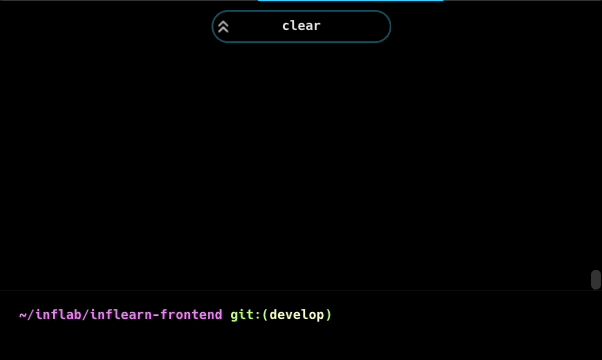
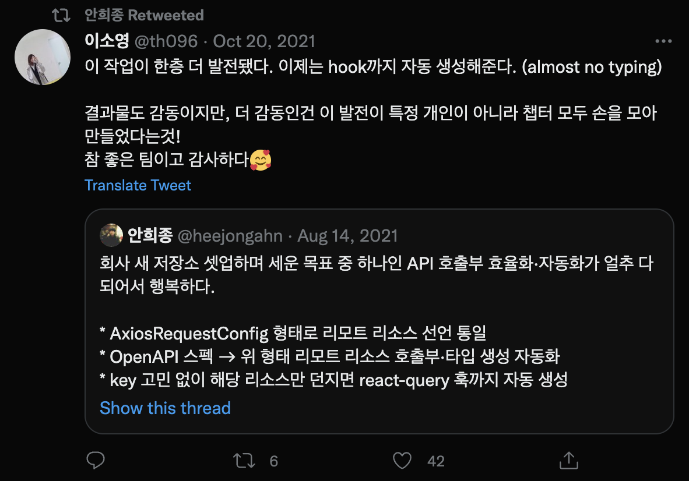

## 들어가며

> 좀 쉬고 싶습니다. 정말 다른 뜻은 없어요.

아무래도 [2021년의 강렬했던 경험](/post-mortem/2021-memoir/)이 알게 모르게 심신을 지치게 한 것 같았다. W사에 합류한 지 2주 만에 퇴사를 결정하며 죄송한 마음을 담아 CTO님께 말씀드렸다. CTO님은 굉장히 당황하셨지만, 결정을 지지해 주셨고 편하게 업무를 마무리할 수 있게 도와주셨다.

그렇게 분에 넘치는 배려를 받으며 퇴사해 약 4개월 정도 휴식을 취했다. 쉬면서 그동안 묵혀두었던 두꺼운 책도 읽고 새로운 언어도 공부했다. 그러면서 틈틈이 몇몇 분들에게 티타임을 요청드리고 이야기를 나누며 미래를 고민하는 시간도 가졌다.

## 1. Inflab CTO와의 첫 만남

현재 나의 보스이자, Inflab의 CTO인 **이동욱** 님(이하 [**향로**](https://jojoldu.tistory.com/))을 만나게 되기까지 재미있는 일이 있었다.

사실 Inflab에 합류하기 전까지 ['개발바닥'이라는 유튜브 채널](https://www.youtube.com/channel/UCSEOUzkGNCT_29EU_vnBYjg)을 운영하시는지도 몰랐고, 단지 [우아한 형제들 퇴사 부검](https://techblog.woowahan.com/2723/)이라는 글과 [2022년 1월 100% 할인 이벤트 장애 부검](https://tech.inflab.com/202201-event-postmortem/)이라는 글을 쓰신 분이라고 기억하고 있었다. 저 글을 흥미롭게 읽고 나서 향로에 대해 궁금함이 생김과 동시에, 언젠가 이야기해 보면 많은 것을 배울 수 있겠다고 생각했던 기억이 난다.

<iframe width="560" height="315" src="https://www.youtube-nocookie.com/embed/jaGnaygzdJA" title="YouTube video player" frameborder="0" allow="accelerometer; autoplay; clipboard-write; encrypted-media; gyroscope; picture-in-picture" allowfullscreen></iframe>

- 제목을 "편협한 프런트 개발자들"로 바꿔보라고 말씀드리며 암살을 시도했었다.

올해 초 퇴사를 하고 쉬게 되면서 '이번 기회에 한 번 만나볼까?'라는 생각에 콜드 메일을 보내려고 마음먹었다. 하지만 뭐라고 써야 할지 도무지 감이 잡히지 않았다. 일단 자기소개를 해야 하나? 블로그 소개 글을 보내면 충분할까? ~~CTO 나와! 라고 해야 하나?~~

이런 고민을 하고 있던 와중에 힐링페이퍼에서 일하고 계신 [정원희](https://wonny.oopy.io/)님과 티타임을 하게 되었다. 원희님께 Inflab도 다음 선택지로 생각하고 있다는 말씀을 드렸더니, 정말 좋은 분이 CTO로 계시고 그분을 잘 알고 있다며 소개해 주겠다고 하셨다. 감사하게도 원희님 덕분에 향로와의 만남이 자연스럽게 성사되었고, 곧 약속을 잡을 수 있었다. ~~역시 인싸끼리는 친하다.~~

그렇게 향로를 처음 만난 건 바람이 부는 추운 2월이었다. 판교에 있는 카페에서 2시간 넘게 서로 막힘없이 즐겁게 기술에 관해 이야기했다. 처음 만났음에도 (내가 느끼기에) 대화가 잘 통하는 것이 신기했고, 짧은 대화 속에서 배운 것들이 많았다. 팀을 운영하는 방법, 문화를 만드는 방법, 비즈니스의 요구사항과 기술 부채를 조화롭게 해결하는 방법, 다른 팀원을 설득하는 방법 등 순수하게 기술에 국한된 주제가 아니라 실제 *팀을 운영하는데 필요한 실질적인 고민*이었다.

작년에 쓰린 경험을 하고 난 뒤 한참 고민했던 주제이기도 했고, ~~왜인지 모르겠지만~~ 향로와 함께 이런 문제들을 풀어나가는 것이 재미있겠다는 생각이 들었다.

## 2. 과제, 면접 그리고 입사 결정

### Vanilla JS로 SPA 만들기

5월에 Inflab에 이력서를 제출했다. 이력서는 바로 통과되었고 과제가 부여되었다. 특이하게도 vanilla JavaScript로 SPA를 만드는 과제였는데, 리뷰어로 참여하고 있는 [프로그래머스 스터디](https://school.programmers.co.kr/learn/courses/14723)에서 많이 접해본지라 어렵게 느껴지지 않았다. 생각보다 많은 디테일을 직접 챙겨야 했기 때문에 과제 하는 내내 재미있었다.

이 과제를 진행하며 [Web Component](https://developer.mozilla.org/ko/docs/Web/Web_Components)를 적극적으로 이용했는데, 그 경험이 생각보다 나쁘지 않아 나중에 블로그로 한번 정리해 볼 생각이다. 지금은 React를 이용하는 과제로 바뀌었기 때문에 지원하시는 분들이 나 같은 스릴~~고통~~을 느끼지 못해 아쉬울 뿐이다.

### 두 번의 인터뷰

과제를 제출하고 피드백이 빨랐던 점이 인상적이었다. 3일 정도 지난 후 과제 전형 통과 알림과 함께 기술 면접 일정이 잡혔다.

기술 면접 내내 재미있었는데, 1시간 30분가량을 쉬지 않고 이야기했던 것 같다. 디자인 시스템, GraphQL, 테스트 도입, 코드 컨벤션 도입, 모노레포 운영 등 다양한 분야에서 질문이 나왔고 그에 대해 담담하게 내 생각을 이야기했다. 질문을 통해 현재 Inflab 프런트엔드 파트가 겪고 있는 문제를 짐작할 수 있었고 어디나 비슷한 고민을 한다는 것을 알 수 있었다. 특히 질문들이 주로 협업이나 팀플레이에 맞춰져 있다는 인상을 받았고, 독단적인 슈퍼 히어로 보다는 같이 협업할 수 있는 개발자를 찾는 듯한 느낌을 받았다.

2차 면접은 CEO, CTO와 진행했다. 주로 레거시 코드를 개선하거나 프로젝트를 리드해본 경험을 질문하셨는데 CTO는 기술적인 성취를, CEO는 팀플레이에 대한 부분을 주로 질문했던 것으로 기억한다. 면접이 끝날 때쯤 궁금한 점을 질문하라고 하셔서 *내가 합류한다면 어떤 부분을 바라거나 기대하고 계시는지 궁금하다*고 물어보았다.

> 음, 당장 Inflab에 합류하셨을 때 답답함을 느끼실 수도 있을 것 같아요. 하지만 경험을 나눠주시고, 즐겁게 일하시면 그 과정에서 성장하는 부분이 분명히 있을거라고 생각해요. 다시 말씀드리지만, 답답하다고 해서 팀원들을 막 밀어붙이지 않으셨으면 좋겠어요.

CEO의 대답이 인상적이었는데, 3달을 지내보니 현재 Inflab이라는 조직의 색을 정확하게 투영하는 대답이었다고 생각한다. 우리 팀은 비록 늦더라도, 옆의 동료들을 존중하며 함께 일하는 것을 중요하게 생각한다.

나는 지금도 무언가를 도입하기 전에 PoC 같은 절차를 통해 동료들을 설득하고 동의를 구한다. 저번 회사의 경험도 있고, 이 부분은 정말 중요하다고 생각해서 큰 불만은 없다.

### Here I go

이번에 이직을 준비하며 세 가지 개인적인 목표를 세웠다.

1. 지인이 없는 팀으로 이직하기
2. 아래 두 조건 중 하나를 만족하는 팀으로 이직하기

   - 팀 구성원이 모두 나보다 실력이 압도적으로 뛰어난 팀
   - 팀 구성원과 경험을 나누며, 내가 생각했던 것들을 실현할 수 있는 팀

3. 레거시를 개선할 기회가 있는 팀으로 이직하기

첫 번째 목표로 지인이 없는 팀에 이직하고자 하였다. 커리어를 돌아보면 첫 회사를 제외하고 항상 지인을 쫓아 이직했었다. 그러다 보니 같이 일한 시간이 길어지며 서로가 일하는 스타일에 익숙해졌고, 나중에는 개선에 대한 피드백을 받기 어려워졌다. 이런 이유로 이번에는 개발자로서 객관적이고 냉정한 평가를 받아보고 싶었다.

또한 지인 없이 이직하여 신뢰가 0인 상황에서 팀의 일원으로 인정받는 경험을 하고 싶었다. 좋은 동료이자 좋은 친구인 [김지훈](https://future-seller.dev/)님의 표현을 빌리자면 `신뢰 채무` 없이 새로운 팀에서 시작하는 연습이 필요하다고 생각했다.

두 번째 목표를 세웠던 이유는 지금 6년 차인 내 경력과 큰 연관이 있었다. 미드 레벨 엔지니어인 지금, 시니어 엔지니어가 되기 위해 엄청난 동료들 사이에서 기술적으로 큰 성장을 하거나 내 경험을 나누며 팀을 리드해보는 경험을 하는 것이 좋을 것 같다고 생각했다.

그저 그런 팀으로 합류해서 어영부영 시간을 보내며 평범한 경험을 하기 싫었고, 앞으로의 커리어에 도움이 될만한 두 가지의 경험 중 하나라도 제대로 해보고 싶었다.

마지막 목표가 필요했던 이유는 여태까지 내가 진행했던 프로젝트에 있었다. 주로 돌격대 역할을 많이 했고, 무언가를 유지보수하기보다는 새로운 서비스를 구축하는 일을 많이 했었다. 그러다 보니 자동차를 처음부터 만든 경험은 많지만, 달리는 자동차의 바퀴를 갈아 끼우는 경험은 거의 없다시피 했다. 그래서 이번에는 서비스하고 있는 레거시를 잘 개선해 보는 경험을 하고 싶었다.

**그렇게, 나는 Inflab으로의 합류를 선택했다.**

## 3. 독특했던 온보딩

2022년 6월 14일 Inflab에 합류했다. 잔뜩 긴장한 상태로 회사에 도착했는데 다행히 같은 날 프런트엔드 파트에 합류하는 입사 동기가 있어 그나마 덜 긴장했던 것 같다.

### 난생처음 겪어본 CS

Inflab에서 겪어본 온보딩 프로세스 중 재미있던 것은, 1주일 동안 CS(customer service) 티켓을 처리하는 것이었다. 대표님의 강한 의지로 모든 신규 입사자들이 한번은 거쳐야 하는 미션인데, Inflab의 서비스를 파악하고 고객의 불편 사항을 파악하는데 이보다 좋은 방법이 없다는 뜻이었다.

나와 입사 동기는 이틀 차에 CS 교육을 받고 다음 주에 바로 투입되었다. 일주일간 들어오는 문의, 불편한 점, 고객의 요청 등등 CS 티켓을 처리하며 자연스럽게 개선 포인트를 찾아낼 수 있었고, CX 팀의 설명대로 [인프런](https://www.inflearn.com/)을 많이 파악할 수 있었다.

### 잘 되어있는 문서화, 하지만 너무 많은 문서

온보딩 과정 중에 읽어야 할 문서의 목록을 전달받았는데 **많아도 너무 많았다**. 일단 양에서 압도되었고 그 내용도 긴 문서들이 많았는데, 한편으로는 이걸 어떻게 다 문서화를 했을까 싶기도 하여 감탄했다. 문서에서 틀린 부분은 바로 수정했고, 필요한 부분은 새로 만들거나 내용을 보충해가며 천천히 하나씩 읽어나갔다. 각 프로젝트에 기여하는 방법, 여러 논의 내용들, 장애 회고 등등 많은 문서가 있었지만 그중 가장 흥미로웠던 문서는 바로 FETR(Frontend Tech Review)이라는 문서들이었다.

매주 한 번씩 진행되는 FETR은 프런트엔드 개발자들이 모두 모여 한 주 동안 있었던 기술적인 이슈나 전체 논의가 필요한 사항들을 다루었는데, 주제도 다양했고 내용도 재미있어서 흥미롭게 읽었던 기억이 있다. 그 문서를 읽으며 현재 프런트엔드 파트가 당면한 문제와 고민하는 부분 등을 살짝 파악할 수 있었고, 단기적으로 무엇을 해야 할지 대략적인 윤곽을 그리는 데 도움을 주었다.

다만 문서의 양이 정말 많아 온보딩 과정 중에 부담을 호소하는 팀원들이 있었고, 온보딩 프로세스를 다시 정립할 때는 문서를 정리하고 읽어야 하는 우선순위를 정하여 목록을 제공하기로 했다.

### 나의 긴장감을 없애러 온 나의 구원자, 나의 서포터

Inflab에는 서포터 문화가 있어 3개월간 새로 합류한 팀원의 옆에 바싹 붙어 전반적인 생활을 챙겨준다. 나는 [홍시](https://emewjin.github.io/)라는 닉네임을 쓰는 파트원이 서포터 역할을 해주었고, 입사 초반에 조직에 적응하는 데 너무나 큰 도움을 주었다.

정말 바쁜 와중에도 나의 질문에 잘 대답해주거나 잘 모르는 회사의 스케줄을 챙겨주었고, 무엇보다 가끔 젤라또를 먹으며 진행한 티타임에서 내 긴장을 많이 풀어주었다. 그 덕분에 자연스럽게 팀에 녹아들 수 있었고 빠르게 팀의 일원이 될 수 있었다. 이렇게 시작부터 손발을 맞추다 보니 서로 합을 맞추는 기간이 거의 없었음에도 자연스럽게 좋은 ~~개그~~호흡을 보이며 같은 셀에서 함께 일하고 있다. 옆에서 일하는 것을 보고 있으면 정말 일을 잘하고 자극이 되는 동료라 나에게 너무나 큰 행운이라고 생각한다.

## 4. 프런트엔드 파트에 합류하고 나서

### 1. Vanilla JavaScript, 근데 이제 OOP를 곁들인

"인프런 코드 체크아웃 받으시면 놀라실 텐데."

팀에 합류한 지 사흘째 되는 날, 팀 동료인 [준프](https://medium.com/@shinbaek89)가 직무 온보딩을 시작하며 농담을 건넸다. 이미 2월에 진행한 티타임에서 향로에게 팀의 상황을 어느 정도 전해 들었기 때문에 그렇게 걱정이 되지는 않았다. 코드를 열어보기 전까지는.

IDE에 펼쳐진 인프런의 서비스 코드는 fxJS와 fxDOM, fxSQL이라는 라이브러리가 기반이 되어 만들어진 자체 framework인 ant-man 위에서 동작하고 있는, 제법 큰 규모의 시스템이었다. 전통적인 MPA + SSR 방식으로 동작하고, 무엇보다 생소한 라이브러리인 fxJS, fxDOM을 알지 못하면 아예 코드를 읽을 수조차 없었다. 더군다나 코드 베이스에 구조를 개선하기 위해 여러 번 시도했던 흔적들이 남아있어 개발 패턴이 혼재된 상황이었다.

솔직히 '왜 이렇게 했을까?'라는 생각이 들지 않았다면 거짓말이겠지만, *팀의 유산을 무시하면 안 된다*는 평소의 신념이 있었기 때문에 얼른 생각을 고쳤다. 항상 이런 레거시 코드를 보면 묘한 감정이 드는데, 분명히 이 "레거시"로 돈을 벌어 회사가 성장했지만, 어느 순간 애물단지 취급을 받으며 개선의 대상이라는 시선으로 보아야 하는 아이러니함이 그 이유일 것이다.

지금은 아니지만, 처음 합류했을 때 프런트엔드 파트에 놀랐던 점은 OOP에 굉장한 관심이 있다는 것이었다. 보통의 경우 OOP는 프런트엔드 분야에서 많이 회자되는 주제는 아니기 때문에 이 정도로 관심을 두는 이유가 궁금했다. 지금 와서 생각해 보면 잘 알려진 framework를 사용하고 있지 않은 상황에서 정답을 찾아야 하는 상황이었기 때문에 그런 것이 아닐까라는 생각이 든다. 물론 CTO인 향로의 영향도 엄청나게 컸겠지만.

아무튼, 현재 ant-man은 Kotlin + Spring / TypeScript + NestJS와 React로 점차 개선되고 있다. 당연히 나 역시 여기에 열심히 기여하고 있다.

### 2. 학습, 열정, open mind

3개월간 느낀 프런트엔드 파트의 가장 큰 장점은 정말 많이 배우고, 쉬지 않고 전진하는 팀이라는 것이다. 파트 내 스터디도 활발하고, 서로 배우고자 하는 욕구가 커서 나도 엄청나게 자극되었다. 최근 오브젝트 스터디에 참여하고 나서 코드를 보는 시야가 넓어져 굉장히 만족하고 있다. OOP의 개념을 프런트엔드에 적용하기 힘들다는 막연한 생각이 눈 녹듯이 사라졌달까. 표현의 방법은 다르지만, 본질은 어느 정도 통한다는 것을 깨닫게 되었다. 그 덕분에 최근 컴포넌트 설계의 관점을 책임 - 메시지의 관점으로 생각해본다거나 캡슐화를 고민해 보는 등 평소와는 다른 고민을 하고 있어 즐겁게 느껴진다.

또한 파트원들이 모두 열린 마음으로 **내가 틀렸을 수도 있음**을 인지하고 있어 편하게 토론하고 의견을 교환할 수 있는 점도 좋다고 생각한다. 그동안 자존심 혹은 무언가의 이유로 "내가 틀렸다"는 말을 절대 하지 않는 개발자들을 많이 보았기 때문에 더욱 그렇게 느꼈는지도 모른다. 평소 건강한 peer pressure를 주고 받을 수 있는 동료를 선호하기 때문에 나와 정말 잘 맞는 팀이라고 생각한다.

### 3. 아쉬운 점

솔직히 아직은 크게 없다. 항상 내가 1인분을 할 수 있을까가 걱정이지, 팀에 대한 큰 불만이나 걱정은 없다. 다만 팀원들이 코드 그 자체에만 몰입하느라 그 코드를 둘러싸고 있는 여러 요소(인프라, 백엔드, 배포 등)에 대한 관심이 상대적으로 적은 것이 상대적으로 아쉽다면 아쉬운 부분일 것이다.

그래서 팀에 합류하고 나서는 API 서버, 인프라, CI/CD에 대한 작은 지식을 나누고 있다. 나도 그렇게 많이 알고 있는 부분이 아니지만, 알고 있는 것을 나누다 보니 다행히도 관심을 두는 팀원들이 늘어나고 있어 개인적으로 만족스럽다.

## 5. 3개월간 무엇을 했나?

### 1. Inflearn my page 개선

팀에 합류한 지 3일만에 학습자 셀에 소속되었다. 학습자 셀은 인프런을 이용하는 사용자들의 학습 경험을 개선하기 위한 목적을 가진 조직으로, 인프런 서비스의 가장 많은 영역에 기여하는 셀이다.
또한 (지극히 개인적인 생각으로) 다른 셀에 비해 상대적으로 기능 구현이 복잡하지 않은 부분을 담당하는 셀이기 때문에 프런트엔드 파트의 공격적인 시도/실험을 담당하는 역할도 맡고 있다.

셀에 소속되어 제일 처음으로 한 일은 [인프런의 my page](https://www.inflearn.com/dashboard)를 React application으로 분리하는 작업이었다.

상술했듯 ant-man은 그리 대중적인 형태의 framework가 아니고 유지보수, 기능확장이 어려운 구조였기 때문에 향로가 내린 결정이었다. 팀 동료 준프의 표현에 따르자면 기술 부채 정도가 아니라 기술 파산 직전의 상태라나.

일단 페이지를 분리하기 위해 현재의 상태를 파악해보았는데, 몇 가지 걸림돌이 있었다.

첫 번째는 많은 기능이 구현되어있는 헤더에 대한 고민이었다. 이미 분리되어있는 강의 시청 페이지는 화면에 헤더가 보이지 않아도 괜찮기 때문에 create-react-app으로 만들어진 별도의 index.html을 그대로 유저에게 제공해도 괜찮았다. 하지만 my page의 경우 별도의 index.html을 사용하려면 기존의 헤더 역시 React로 구현해야 하는 상황이었다.

   <figure>
      
      <figcaption style="font-size: 14px;">
         - 많은 기능이 포함되어있는 인프런 헤더
      </figcaption>
   </figure>

그래서 나와 홍시는 헤더를 제외한 실제 my page 영역만 React로 만들어진 코드로 대체하기로 했다. 실현 방법은 누구나 생각할 수 있는 매우 간단한 방법으로, 빌드한 번들 파일을 CDN에 업로드하여 my page에서 `<srcipt>` 태그로 실행하는 방식이었다.

아이디어 자체는 매우 단순했지만, 실제 구현 단계에서는 local 개발에만 필요한 부분들이 번들 파일에 포함되거나 ant-man의 기존 global style에 영향을 받아 의도하지 않은 결과를 보여주는 등 우여곡절이 있었다.

지금은 다행히 어느 정도 안정화가 되어 원하는 결과를 얻게 되었다. React application을 분리할 때 했던 선택들에 대해서는 나중에 글로 한 번 정리할 생각이며, ant-man의 global style과 분리하는 방법은 같은 팀원인 홍시가 [먼저 잘 정리해 주었다.](https://tech.inflab.com/content/202208-shadow-root/)

두 번째 걸림돌은 백엔드 API에 대한 부분이었다. 우선 백엔드 API가 전혀 없는 상태에서 API와 프런트엔드의 작업을 병렬로 진행할 수 있는 방법을 찾아야 했다. 백엔드 API를 mocking 하는 방법은 많지만, 외부 서비스를 사용할 경우 설정에 대해 번거로움이 있었고, 그렇다고 해서 백엔드 API가 완성될 때까지 마냥 기다릴 수는 없었다.

우리는 강의실 셀에서 검증한 방법으로 간단히 이 걸림돌을 해결하였는데, [msw](https://mswjs.io/)와 [faker](https://fakerjs.dev/)를 함께 사용하는 방법이었다. API spec을 먼저 합의한 다음 msw로 mock up을 하고, faker로 데이터를 채워 넣는 형태로 진행되었다. 이에 대해서는 [더 좋은 글](https://tech.kakao.com/2021/09/29/mocking-fe/)이 있으니 읽어보면 좋을 것 같다.

### 2. Monorepo + turborepo 도입

내가 합류했을 당시 인프런은 일하는 방식에 있어 격변기를 맞고 있었는데, 그중 하나가 목적조직으로의 개편이었다. 자연스럽게 기존의 일하던 방식들을 다시 고민해야 했고, 그 고민중 하나가 코드를 관리하는 문제였다. 프런트엔드 파트의 파트원들이 각 셀로 흩어져 일하게 되는 구조로 바뀌었기 때문에 기존의 코드 관리 전략과는 다른 접근이 필요한 상황이었다.

제일 처음 했던 논의는 *레포지토리를 어떻게 관리할 것인가*에 대한 부분이었다. 해당 논의에서 나는 레포지토리를 셀별로 관리하지 말고 monorepo로 관리하자고 강력하게 주장했다. 이렇게 주장한 몇 가지 이유는 다음과 같다.

1. 디자인 시스템을 개발하고 있는 상황에서 빠른 `사용 -> 피드백 -> 수정` 루프가 필요했다. 만약 디자인 시스템 레포지토리가 분리된다면 git registry에 배포해야 하므로 빠른 피드백 루프를 달성하기 어려운 문제가 있다.
2. eslint, stylelint, prettier, vite config 등 [conformance](https://developer.chrome.com/blog/conformance/)를 위한 설정 관리의 번거로움을 없앨 필요가 있었다. 특히 우리 파트는 공통의 코드 스타일과 룰을 중요하게 생각하기 때문에 이 부분을 관리하는 것이 번거로우면 안 될 거라고 생각했다.
3. 가장 큰 이유로 *out of sight, out of mind*를 막고 싶다는 생각이 컸다. 바쁜 와중에도 서로 다른 셀에 대한 관심의 고리를 유지할 방법이 필요하다고 생각했다.

위의 이유로 프런트엔드 파트는 ant-man을 제외한 나머지 코드들이 monorepo로 관리되고 있으며, 아직은 의도한 효과를 잘 발휘하고 있다고 생각한다.

이렇게 monorepo로 모든 셀의 코드를 관리하다 보니 실질적인 기술적 문제들이 생겼는데, 특히 패키지 간의 의존성과 배포에 대한 부분이 제일 컸다. 이 문제는 [turborepo](https://turborepo.org/)를 도입하여 해결했다.

특히 DevOps 팀과 협력하여 turborepo의 filter 기능을 이용해 셀 별로 코드를 배포할 수 있는 시스템을 구축했기 때문에, 개발자가 더 빠르고 자신 있게 코드를 병합할 수 있게 되었다.

Turborepo에 관해서는 [이 글을](https://engineering.linecorp.com/ko/blog/monorepo-with-turborepo) 읽어보면 좋을 것 같다.

### 3. 자동화 툴 도입 / 제작

#### hygen

회사의 디자인 시스템에 기여하기 위해서 반복적으로 수행해야 하는 작업이 있다. 현재 우리 파트는 [mantine](https://mantine.dev/)을 확장하여 구축하고 있기 때문에 mantine에서 필요한 코드와 타입을 import 하는 부분을 반복적으로 선언해야 하고, storybook 등 관련한 파일들을 특정 경로 하위에 만들어 주어야한다. 파일을 잘 만들었다면 main.tsx에서 export 해야 하는 일도 필요했다.

이렇게 무의미하게 반복되는 작업을 줄이고 싶었고, 코드 리뷰에서 불필요하게 발생하는 storybook 문서 작성 방법에 대한 리뷰를 줄이고 싶었기 때문에 [hygen](https://www.hygen.io/)을 도입했다.

<figure>
  
  <figcaption style="font-size: 14px;">
    - 자동화는 대부분의 경우 옳다고 생각한다.
  </figcaption>
  </figure>

처음에는 디자인 시스템에만 사용했는데, hygen에서 제공하는 기본적인 기능들이 다양하여 templating이 가능한 작업은 전부 hygen으로 자동화할 수 있었다. hygen의 사용법에 대한 것은 [이 문서](https://techblog.woowahan.com/8268/)에 잘 나와 있어 읽어보면 좋을 것 같다.

#### code generator

이전에 있었던 팀에서는 GraphQL을 사용하고 있어서 자연스럽게 [GraphQL code generator](https://www.graphql-code-generator.com/)을 함께 사용했었다. 하지만 Inflab의 API는 RESTful 형태로 제공하고 있기 때문에 타입과 react-query를 사용하는 hooks 들을 수동으로 일일이 정의해야 하는 상황에 직면하게 되었다. 이미 code generator의 강력함과 편리함을 체험했었던 나로서는 다시 이런 상황이 닥친 것에 대해 몸서리를 칠 수밖에 없었고, 곧 해결책을 고민하기 시작했다.

마침 API 서버가 swagger 문서를 제공하고 있어서 opan api specification을 TypeScript의 타입으로 변환시키는 여러 라이브러리를 찾아 테스트해 보았다. 하지만 당면한 문제를 속 시원하게 해결해 주는 라이브러리는 없었고, 예전에 flex team에서 비슷한 상황을 해결하는 라이브러리를 직접 만들었다는 사실이 떠올랐다.

<figure>
  
  <figcaption style="font-size: 14px;">
    - 사실 처음 봤을 때는 '그냥 GraphQL 쓰시지...'라고 생각했었다. 출처: <a href="https://twitter.com/th096/status/1450479206681518091?s=20&t=IB81RIntQNc-Ck7A7qpK8g" target="_blank" rel="noopener noreferrer">이소영님 트위터</a>
  </figcaption>
  </figure>

이에 직접 구축해도 좋겠다는 생각이 들었고, 그에 대한 확신이 서자 함께 일하는 홍시와 시간이 날 때마다 기능을 만들었다. 그 결과 현재 모든 API response의 type을 자동으로 만들어주고, GET 요청에 대한 custom hooks까지 자동으로 만들어줄 수 있는 형태까지 완성되었다.

아직 많이 사용도 못 해보았고 추가되어야 하는 기능들이 많은 초기 버전이지만, 이런 것들에 대해 파트원들이 큰 관심을 보여주고 지지해 주는 것은 언제나 고마운 일이라고 생각한다. 나도 올해 트위터 혹은 회고록에 자랑할 수 있게끔 잘 완성할 수 있었으면 좋겠다.

### 4. 디자인 시스템

내 경력에서 디자인 시스템은 꼭 성공해 보고 싶은 것 중 하나이다. 왜냐하면 이미 두 번에 걸친 실패를 경험했기 때문이다. 내가 팀에 합류했을 때는 이미 구축을 시작한 상태였고 이에 대한 진행 상황이 궁금했다. 바로 물어보거나 참견을 할 수도 있었지만, 서두르지 않고 디자인 시스템에 관련된 모든 회의록과 슬랙 대화를 읽어보며 현재의 결정을 이해하기 위해 노력했다. 다행히 회의록이 잘 정리되어 있어 문맥을 파악하는 것이 어렵지 않아 지금의 결정을 이해할 수 있었다.

한가지 마음에 걸리는 부분은 mantine이라는 디자인 시스템을 확장하여 시스템을 구축하기로 합의했다는 점이었다. 내 경험상 디자인팀이 있는 경우 외부의 디자인 시스템을 만들어진 그대로 사용하는 경우는 없었다. 그렇게 조금씩 component를 변경하다 보면 언제나 커스터마이징과 확장에 대한 제약사항이 발생했고, 이는 디자이너와 프런트엔드 개발자 모두가 만족하지 못하는 상황이 발생하는 원인이 되었다.

아니나 다를까, 본격적으로 구축을 시작한 지 얼마 되지 않아 예상한 문제들이 조금씩 발생하고 있다. 일단 디자인팀과 합의한 부분이 있기 때문에 v1은 mantine으로 만들어 놓고, v2는 [radix-ui](https://www.radix-ui.com/)같은 headless 디자인 시스템을 이용해 구축해볼 생각이다.

## 6. 돌아보니 어땠나

팀에 합류했을 때 시도해보려고 한 부분이 있었다.

- 팀의 유산을 무시하지 않기. 여기에는 모든 행동, 발언이 포함됨.
- 답답하든, 의아하든, 이해가 되지 않든 일단은 지켜보기.
- 팀에 필요한 부분을 찾아보고 부족한 부분은 기여해보기.
- 팀 전체적으로 생산성을 끌어올려 보기.

만약 팀에 합류하게 된다면 내가 팀에서 경력이 가장 많다는 것을 이미 알고 있었기 때문에 발언과 행동들을 조심하려고 했다. 특히 내가 '경력으로 찍어누르는 것' 같이 보이지 않기 위해서 부단한 노력을 했다. 다행히 동료들로부터 받았던 피드백에서 이런 말이 없었지만 언제든 발생할 수 있다고 생각하기 때문에 처음의 마음을 유지하려고 노력하고 있다.

온보딩 기간에는, 모두가 바쁜 와중에 누군가는 해야 하지만 하기에는 귀찮은 일을 주로 찾아다녔다. 특히 새로운 기술에 대한 PoC를 많이 진행했고 상술한 hygen, turborepo, code generator 같은 것이 여기 해당한다. 요즘에는 온보딩 프로세스를 나서서 개선해 보고 있는데 나름대로 의미가 있는 것 같아 재미있게 하고 있다.

이 외에 'DevOps와 대화하기 위한 넓고 얕은 인프라 지식'같은 세미나를 열어 팀에 부족한 인프라, 배포, CI에 대한 지식을 공유하기 위해 노력했다. GraphQL, zero runtime CSS같이 팀의 입장에서 보았을 때 새로운 기술들을 소개하는 자리도 가졌다. 이를 위해 FETR(Frontend Tech Review)에 적극적으로 참여했다.

합류하고 6주가 되었을 때 셀프 피드백과 동료 피드백을 받는 시간이 있었다. 솔직히 스스로가 만족스럽지 못했고, 이를 셀프 피드백에 썼는데 동료 피드백이 너무 좋아서 당황했었다. HR팀도 입사 6주 미팅을 하며 두 종류의 피드백이 너무 달라서 놀랐다고 한다.

동료들이 나를 인정해 주는 것과 내가 시도해 보려고 한 것들의 의도를 잘 알아주어 너무나 고맙지만, 한편으로 나는 아직도 스스로 만족스럽지 못하다. 솔직히 동료들이 나의 진짜 모습을 알게 될까 봐 두려운 부분도 있다. 이런 것들은 향로가 이야기했던, *기대와 신뢰를 구분*하는 것으로 벗어나 보려고 한다.

## 7. 앞으로의 계획

> 시니어를 채용하는 이유는 새로운 문화를 만들기 위해서고, 주니어를 채용하는 이유는 문화를 더 단단히 만들기 위해서다.

향로가 저번 티타임때 나에게 해준 말이다. 그때 당시 이 이야기를 듣고 *나는 문화를 새로 만드는 사람이 되어야 하는가, 단단히 만드는 사람이 되어야 하는가*를 되물었다. 경력으로 보았을 때 확실히 주니어는 아니지만, 그렇다고 시니어도 아니라는 생각에서였다. 향로는 잠시 고민하더니 우문현답해주었다.

> 그건 제가 정해드릴 수는 없고, 스스로 선택하셔야 하지 않을까요?

안 그래도 고민거리가 많았는데 친절한 향로는 고민을 하나 더 얹어주었다. 사실 CTO 입장에서 *기대는 할 수 있겠지만 결정을 할 수는 없는 부분*이다 보니 가장 합리적인 답을 주신 게 아닐까 싶다.

최근 *'이대로 괜찮은가?'*라는 생각을 많이 하게 되었다. 나보다 늦게 시작하신 분들도 나를 금방 쫓아오는 것 같은데, 내가 함께 일했던 선임 개발자들은 멀리 뛰어가고 있는 듯한 느낌이 들어서이다. 초조한 마음에 한동안 주말마다 [Career Ladders](http://www.engineeringladders.com/)를 보면서 내가 어디쯤 와있나를 고민하기도 했다. 결국 답을 내리지 못했지만 말이다.

사실 Inflab에서 구체적으로 무엇을 해야겠다고 마음먹은 것은 하나도 없다. 다만 추상적인 목표가 하나 있는데 `시니어 엔지니어`라는 타이틀을 얻어도 부끄럽지 않은, 그런 개발자로 성장하는 것이다. 앞으로 Inflab에서 팀원들과 함께 **배우고, 나누고, 성장하는** 경험을 블로그에 많이 적을 수 있으면 좋겠다.
