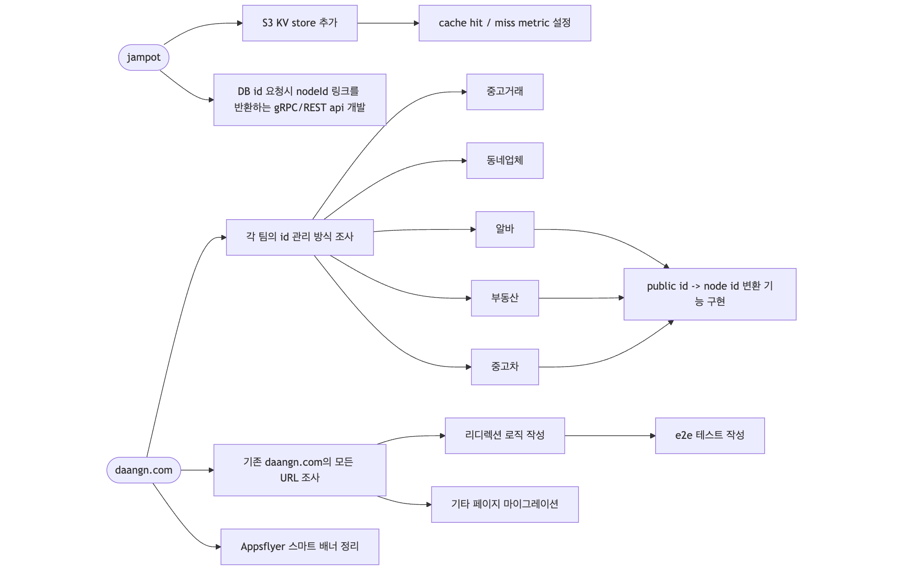
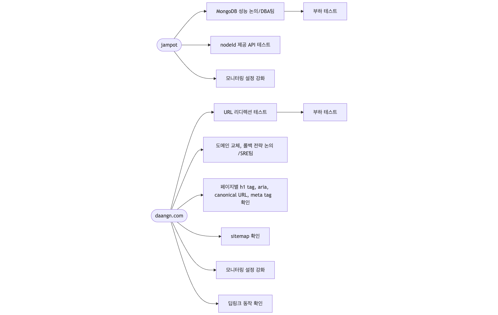

[[tip]]
| 이전의 상황은 <a href="https://medium.com/daangn/%EC%9B%B9%EC%82%AC%EC%9D%B4%ED%8A%B8%EC%9D%98-%EC%B2%AB-%EC%82%BD%EB%B6%80%ED%84%B0-%EB%82%98%EB%AC%B4%EB%A5%BC-%EA%B8%B0%EB%A5%B4%EA%B8%B0%EA%B9%8C%EC%A7%80-%EB%8B%B9%EA%B7%BC%EB%8B%B7%EC%BB%B4-%EB%94%94%EB%B2%A8%EB%A1%AD%EC%9D%98-%EC%97%AC%EC%A0%95-830cc1a27bf0" target="_blank" rel="noopener noreferrer">웹사이트의 첫 삽부터 나무를 기르기까지: 당근닷컴 디벨롭의 여정</a>에 자세히 정리되어 있다. 좋은 내용이 꼼꼼히 정리되어 있어 읽어보면 상황을 이해하는 데 도움이 크게 될 것이다.

당근닷컴 마이그레이션 계획은 내가 입사하기 전부터 이미 진행되고 있었던 과제였다. 나는 이니시에이터라기 보다는 이미 시작된 프로젝트에 합류한 상황이었다. 그래서 프로젝트의 맥락을 파악하는 동시에 프로젝트를 진행해야 했기 때문에 초반에는 아주 바빴던 것으로 기억한다.

거의 모든 제품 팀과 협업했고, 인프라 작업이 필요해 SRE팀과의 긴밀한 협업 역시 필요했다.

훌륭한 동료들과 함께 약 1년간 진행한 이 마이그레이션 프로젝트는 성공적으로 마무리되었고, 이 덕분에 제품을 보는 관점과 기술에 대한 시야가 넓어진 것을 느꼈다. 이제부터 그때의 기억과 감정을 더듬어보려고 한다.

## 1. 왜 당근닷컴 마이그레이션을 진행하게 되었을까?

처음 팀에 합류했을 때의 당근닷컴은 Ruby on Rails 서버에서 동작하는 페이지와, Next.js로 동작하는 페이지가 공존하고 있었다. 각 페이지는 웹사이트 파트가 아닌 각 서비스팀의 프론트엔드 개발자들이 코드를 직접 기여하는 형태로 구성되어 있었는데, 이는 몇 가지 고질적인 문제를 야기했다.

첫 번째로, 웹사이트의 헤더 같은 공통적인 요소가 수정되면 두 프로젝트 모두 배포가 필요하다는 문제가 있었다. Next.js 프로젝트에서 공통 컴포넌트를 수정하고 배포하면, Ruby on Rails 서버에 바뀐 commit hash 값을 적용해 공용 컴포넌트를 새로 로드하는 작업이 필요했다.


두 번째로, 각 팀의 프론트엔드 개발자가 기여를 하는 형태로 프로젝트를 운영하다 보니 Next.js 레포지토리는 그 자체로 회색지대가 되어버렸다.

각 팀 입장에서는 앱에서 구동되는 웹뷰 프로젝트에 비해 중요한 프로젝트가 아니었기 때문에 이 프로젝트의 코드에 대한 관심도가 상대적으로 떨어지는 것은 어쩔 수 없었다.

린트 규칙으로 해결할 수 없는 각 팀의 코드 컨벤션이 섞이는 문제도 있었고, 전체적으로 relay.js를 사용하게 되어있어 프로젝트에 기여하려면 relay.js에 대한 지식이 강제되었다. 또한 서비스별로 페이지에 대한 디자인이 상이했기 때문에 사용자에게 일관된 경험을 주지 못했다.


세 번째로, 서비스 장애에 대응하고 코드 베이스의 퀄리티를 관리할 주체가 누구인지 불분명했다는 문제가 있었다. 웹사이트 파트 입장에서는 각 팀의 개발자가 코드에 기여하기 때문에 코드 리뷰가 힘들었고, 특정 로직에 대해 문제가 발생했을 때 자체적으로 대처하기 힘들었다. 다른 팀으로서도 일단 관리 주체는 명시적으로 웹사이트 파트였기 때문에 모니터링이나 장애 알람을 받는 것이 애매한 상황이었다.


마지막으로, 당근의 퍼머링크 스펙에 맞추어 모든 URL을 정형화하고 웹에 공개할 콘텐츠의 id 체계를 관리해야 할 필요성이 제기되었지만, 어떤 팀이 책임질 것인지 결정하기 애매한 문제가 있었다.

결국 당근의 웹을 조금 더 성장시키기 위해서, _전문적인 팀이 웹사이트의 모든 부분을 책임지는 형태가 더 알맞을 것_이라는 결론에 이르렀다. 그렇게 당근의 웹을 책임지는 SEO Growth 파트가 신설되었고, 당근닷컴을 **새로운 시스템**으로 이전하는 작업이 시작되었다.

## 2. 그래서 무엇을 했을까?
[[warning]]
| 너무 당연한 이야기지만, 혼자 이 프로젝트를 진행하지 않았다. 시간이 흘렀기 때문에 어떤 일을 누가 했는지 명확하게 언급하지는 못하지만, 많은 팀의 동료들에게 도움을 받았다. 특히 물심양면으로 도와준 토니, 함께 고생한 SEO Growth 파트 리바이와 에스더, 다른 팀임에도 관심을 두고 조언을 아끼지 않았던 애셔와 팀에게 감사의 표시를 하고 싶다.

생각보다 여러 팀과 얽힌 큰 규모의 작업이었기 때문에, 먼저 필요한 작업을 정리하고 체크리스트를 만드는 것으로 프로젝트를 시작했다. 필요한 작업을 크게 두 단계로 나누고, 각 단계에 대한 마감 일정을 정했다.
Phase 1에서는 기존의 시스템을 통합하는 기능을 구현하는 작업이 주를 이루었다.
<center>
  <figure>
    
    <figcaption style="font-size: 14px">
      - migration phase 1
    </figcaption>
  </figure>
</center>

Phase 2에서는 통합된 시스템을 배포하기 위해 다른 팀과 논의하고, 본격적인 운영을 준비하는 작업을 진행했다.
<center>
  <figure>
    
    <figcaption style="font-size: 14px">
      - migration phase 2
    </figcaption>
  </figure>
</center>

### 1. 각 서비스의 페이지 만들기

먼저 각 팀의 서비스 페이지를 옮겨오는 작업부터 시작했다. 각 팀을 돌아다니며 사용할 API 인터페이스를 협의하고 디자인을 요청했다. 새로운 페이지의 디자인은 여의치 않을 경우 같은 팀의 동료가 어떻게든 피그마에 디자인을 추가했다.

이 과정에서 디자인 코어팀의 애셔가 당근의 웹 디자인 시스템을 만들기로 결정하고 필요한 컴포넌트들을 추가했다. 덕분에 작업 속도가 굉장히 빨라졌는데, 디자인 시스템과 연계된 figma codegen 덕분에 거의 모든 화면을 복사-붙여넣기로 만들 수 있었기 때문이다. 물론 구체적인 로직은 직접 작성해야 했지만, UI를 구현하는 시간을 절약하는 것만으로도 굉장한 시간이 절약되었다. 나중에 이 컴포넌트들은 carotene이라는 이름의 웹 디자인 시스템으로 분리되었다[^1].

서비스별로 일관성 없던 URL 구조도 상하 관계를 맺도록 설정했고, h1 tag, title, description 등 콘텐츠를 표현하는 요소들을 일관성 있게 수정했다. 하나의 콘텐츠와 관련된 다른 콘텐츠들은 모두 a tag로 연결해 SEO 측면에서 콘텐츠의 연결을 더 강화했다. 개인적으로 이 작업도 재미있었는데 최대한 a tag 연결을 늘리기 위해 이런저런 고민을 했던 게 기억에 남는다. 모두가 같이 고민한 덕분에 기존 웹사이트보다 더 많은 연결을 만들어 냈다.

웹사이트의 접근성을 향상시키는 것도 우리 팀의 주요 관심사 중 하나였다. h tag의 배치와 tab 키의 동작, aria tag 사용, 적절한 HTML tag를 사용하는 등 눈에 보이지는 않지만, 필요한 요소들을 꼼꼼히 신경 썼다. 디자인 시스템 컴포넌트 역시 접근성을 고려해서 설계되었기 때문에 쉽게 작업할 수 있었다.

### 2. 기존의 SEO 성과 유지하기

외부에서 우리 콘텐츠로 접근할 수 있는 URL 체계가 크게 바뀌었지만, 이전 URL을 이용한 외부와의 연결은 유지해야 했다. 우리 서비스를 사용하고 있는 사용자들의 불편함을 없애는 것이 목적이기도 했지만 daangn.com이 갖고 있던 기존의 SEO 성과를 잃을 수 없었기 때문이다.

일단 우리 팀은 원래의 웹사이트가 제공하고 있던 모든 URL을 전수 조사 하기 시작했다. 우선 Next.js에 구현된 페이지와 Ruby on Rails로 구현된 페이지의 모든 URL을 코드에서 찾아냈다. 이어서 "daangn.com" 도메인을 쓰고 있는 모든 URL을 찾아내기 위해 bing webmaster의 힘을 빌렸다. Bing bot이 크롤링한 페이지의 구조를 확인할 수 있는 기능이 있어 비교적 쉽게 알아낼 수 있었다. 확인된 URL 중 우리 팀이 관리할 URL을 따로 구분하고, 나머지 URL 중 오너십이 명확하지 않은 페이지들은 삭제하거나 적절한 오너십을 발휘할 수 있는 팀에 인계했다.

우리 팀이 앞으로 관리해야 할 URL을 모두 확인하고 난 뒤, 기존의 URL을 어떤 상태코드를 이용해 새로운 URL로 리디렉션할지 정리했다. 이때 새로운 URL은 당근의 퍼머링크 스펙에 맞추어 재정의했다[^2]. 예를 들어 중고 거래 게시글에 접근할 수 있는 기존의 URL `/articles/:dbId`를 *301*의 상태코드와 함께 새로운 URL인 `/kr/buy-sell/:title-:nodeId`로 리디렉션 하는 정책을 정한 것이다.

이렇게 정리한 리디렉션 정책은 40여 개에 달했고, 이를 모두 _코드의 로직으로 관리_ 한다면 엄청난 복잡도를 수반할 것이 뻔한 상황이었다. 결국 우리 팀은 리디렉션 정책을 _선언적으로 관리_ 하고 복잡한 부분은 자동으로 코드를 만들어주는 프레임워크를 개발했다.

이 프레임워크는 다음과 같이 동작한다. 우선 yml 파일에 리디렉션 정책을 나열한다.
```yaml
# redirects.yml
redirectionPolicy:
  version: 0.0.1
  rules:
    - source: "/articles/:dbId(/)"
      destination: "/(:c/)buy-sell/:title-:nodeId/"
      statusCode: 301
      handler: "handleBuySellArticles"

    - source: "/kr/job-posts/(:title-):publicId(/)"
      destination: "/kr/jobs/(:title-):nodeId/"
      statusCode: 301
      handler: "handleJobPosts"
```
그리고 다음과 같은 명령어를 실행한다. 
```sh
$ yarn karrotmarket generate -c ./redirects.yml -o $PATH_TO_GENERATED_FILE 
```

성공적으로 동작했다면 `-o` 옵션으로 주어진 경로에 다음과 같은 파일이 자동으로 생성된다.

<disclosure title="generated file">

```ts
import type { ConfigSchema, StatusCode, RedirectionContext } from '@karrotmarket-com/redirects';
import URLPattern from "url-pattern";

export type HandlerInput = {
  url: URL;
  header?: Record<string, string>;
  cookie?: Record<string, string>;
  rule: Rule;
};

export type Rule = {
  source: string;
  statusCode: StatusCode;
  destination: string;
  handler?: string | undefined;
}

type HandlerOutputPassthrough = {
  result: "passthrough";
};

type HandlerOutputStop = {
  result: "stop";
};

type HandlerOutputRedirect = {
  result: "redirect";
  response: {
    url: string;
    statusCode: StatusCode;
    header?: Record<string, string>;
    cookie?: Record<string, string>;
  };
};

export type HandlerOutput =
  | HandlerOutputPassthrough
  | HandlerOutputStop
  | HandlerOutputRedirect;

export type Handler = (input: HandlerInput) => Promise<HandlerOutput> | HandlerOutput;
export type HandlerMap = {
  handleJobPosts: (args: RedirectionManagerRunArgs & Rule & ({ title: string; publicId: string; }), context: RedirectionContext | undefined) => Promise<HandlerOutput> | HandlerOutput;
  handleBuySellArticles: (args: RedirectionManagerRunArgs & Rule & ({ dbId: string; }), context: RedirectionContext | undefined) => Promise<HandlerOutput> | HandlerOutput;
};

type RedirectionManagerRunArgs = {
  url: URL;
  header?: Record<string, string>;
  cookie?: Record<string, string>;
}

type RedirectionManagerRunReturn =
| Promise<
    | HandlerOutputPassthrough
    | HandlerOutputStop
    | (HandlerOutputRedirect & { rule: Rule })
  >
| (
    | HandlerOutputPassthrough
    | HandlerOutputStop
    | (HandlerOutputRedirect & { rule: Rule })
  );

export interface RedirectionManager {
  run: (
    args: RedirectionManagerRunArgs,
    context: RedirectionContext,
  ) => RedirectionManagerRunReturn;
}

export const rules: ConfigSchema["redirectionPolicy"]["rules"] = [
  {"source":"/kr/job-posts/(:title-):publicId(/)","statusCode":301,"destination":"/kr/jobs/(:title-):nodeId/","handler":"handleJobPosts"},
  {"source":"/articles/:dbId(/)","statusCode":301,"destination":"/(:c/)buy-sell/:title-:nodeId/","handler":"handleBuySellArticles"},
];

export function createRedirectionManager(
  handlerMap: Record<string, (args: any, context?: RedirectionContext) => Promise<HandlerOutput> | HandlerOutput>,
): RedirectionManager {
  return {
    run: async (input, context) => {
      for (const rule of rules) {
        const sourceUrlPattern = new URLPattern(rule.source);
        const sourceMatch = sourceUrlPattern.match(input.url.pathname);
        if (!sourceMatch) {
          continue;
        }

        if (rule.destination === input.url.pathname + input.url.search) {
          break;
        }

        const handler = rule.handler ? handlerMap[rule.handler] : null;
        const destinationUrlPattern = new URLPattern(rule.destination);

        if (!handler) {
          const destination = destinationUrlPattern.stringify(sourceMatch);

          return {
            result: "redirect",
            response: {
              url: destination,
              statusCode: rule.statusCode,
            },
            rule,
          };
        }

        const output = await handler({ ...input, ...rule, ...sourceMatch }, context);
        if (output.result === "redirect") {
          return {
            result: "redirect",
            response: output.response,
            rule,
          };
        }
        if (output.result === "passthrough") {
          continue;
        }
        if (output.result === "stop") {
          break;
        }

        throw new Error("Handler does not return valid redirect status. Please return one of 'redirect', 'passthrough', or 'stop'");
      }
      return {
        result: "passthrough",
      };
    },
  };
}
```

</disclosure>

그 후에는 이 파일에서 생성된 `createRedirectionManager`에 실제 구현이 담긴 `handlerMap` 객체를 전달한다.

<disclosure title="handlerMap">

```ts
import { createRedirectionManager } from "./createRedirectionManager";

export const redirectionManager = createRedirectionManager({
  handleJobPosts: async ({
    url,
    title: encodedTitle,
    publicId,
    destination,
    statusCode,
  }) => {
    const nodeId = await findNodeId()

    if (typeof nodeId !== "string") {
      return {
        result: "redirect",
        response: {
          url: generateDestinationURL({
            pattern: destination,
            title,
            nodeId: publicId,
            extendSearchParams: url.searchParams,
          }),
          statusCode: StatusCodes.TEMPORARY_REDIRECT,
        },
      };
    }

    return {
      result: "redirect",
      response: {
        url: generateDestinationURL({
          pattern: destination,
          title,
          nodeId,
          extendSearchParams: url.searchParams,
        }),
        statusCode,
      },
    };
  },

  handleBuySellArticles: async () => {
    //...
  },
})
```

</disclosure>

이렇게 구현한 redirectionManager는 fastify의 onRequest hook에 등록한다.

```ts
fastify.addHook("onRequest", async (req, reply) => {
  const { result, response } = await options.redirectionManager.run(
    {
      url: originalURL,
    },
    {
      ip: requestMeta.ip,
      region: resolvedRegion,
    },
  );

  if (result === "passthrough") {
    return;
  }

  reply.status(response.statusCode).redirect(response.url);
})
```

결과적으로 리디렉션 정책은 yml 파일의 선언으로 쉽게 확인할 수 있었고, 실제 복잡한 구현은 자동으로 만들어지는 신뢰할 수 있는 코드에 상당 부분 위임할 수 있었다.[^3]

이에 맞추어 리디렉션 자체의 로직이 변경되거나 정책이 추가/삭제되었을 때 쉽게 테스트하기 위해 [puppeteer-cluster](https://www.npmjs.com/package/puppeteer-cluster)를 이용해 e2e 테스트를 작성했고, 콘텐츠를 하나의 id 체계로 관리하기 위해 SDK와 API를 개발했다. 이때 추가한 e2e 테스트는 SRE에서 진행한 웹/앱 트래픽 분리 작업을 지원할 때도 유용하게 사용했다[^4].

이 작업을 통해 마이그레이션 이후 웹에 공개되는 당근의 UGC(User Genereated Content)는 퍼머링크 스펙을 따르게 되었고, 이전에 공개된 콘텐츠 역시 퍼머링크 스펙으로 접근할 수 있게 되었다.

### 3. 외부 의존성을 덜어내고 더 빠르게 동작하도록 만들기

우리 웹사이트는 수많은 외부 의존성을 가지고 있는데, 당근에서 거의 모든 팀이 생산하는 콘텐츠를 보여주는 허브 역할을 하고 있기 때문이다. 그래서 의존하고 있는 서비스에서 장애가 발생하더라도 웹사이트는 동작할 수 있게끔 외부 의존성을 덜어내는 작업이 필요했다. 또, 크롤러나 사용자의 인입으로 발생할 수 있는 반복적인 API 호출을 줄여서 의존하고 있는 마이크로서비스의 부하를 줄여야 했다[^5].

그래서 우리 팀은 `remote-db-snapshot`이라는 패키지를 추가했다. 이 패키지는 sqlite3을 이용해 file system에 미리 seeding 한 데이터를 읽어오는 역할을 맡았다. Seeding한 데이터는 주로 지역 정보와 같이 주기적인 업데이트로도 충분한 데이터와 미리 연산해 놓으면 좋을 데이터를 저장했고, 이 패키지에서 데이터를 찾지 못했을 때만 필요한 API를 호출하는 형태로 변경했다.

DBA 팀의 도움을 받아 우리 팀이 운영하는 콘텐츠 제공 API 서버의 사양을 업그레이드하는 작업도 진행했고, CPU/memory 사용량을 줄이기 위해 큰 규모의 코드 리팩터링도 병행했다. Hot path 위주로 프로파일링을 진행한 다음 문제가 되는 부분을 수정하는 것을 반복했다. 그 덕분에 최소/최대 파드 개수를 줄일 수 있었다.

Admin과 sitemap의 배포를 분리한 것도 큰 도움이 되었다. 특히 sitemap의 경우 5만 개의 URL을 서빙하고 있었는데, 매번 API 호출이 필요했다. 이 부분을 별도의 패키지로 분리해 미리 만들어진 sitemap을, CDN을 통해 제공하도록 만들었고 웹사이트와 별도로 배포하게끔 했다. 특히 우리 팀은 사이트맵에 들어갈 콘텐츠도 관리했기 때문에 배포를 분리하도록 한 결정은 정말 잘했다고 생각한다. 성능에 큰 영향은 없었지만, admin bundle을 웹서버가 직접 제공하지 않고 미리 번들링된 파일을 CDN을 통해 제공하도록 만들었다.

별도의 worker 서버를 배포해 웹페이지를 제공하는 것 이외의 모든 일을 worker 서버에서 처리하도록 변경했다. 이 worker 서버에는 운영에 필요한 API, kafka consumer, MCP server 등 다양한 역할을 수행하고 있다. Worker를 추가함으로써 웹서버의 부하를 조금 더 줄이고, 내부적인 운영 이슈와 웹사이트 이슈를 분리해 다룰 수 있게 되었다.

이렇게 웹사이트를 제공하는 것 이외의 기능은 별도의 패키지로 분리해 성능을 조금 더 끌어올릴 수 있었다.

### 4. 운영 이슈 대응 준비하기

웹사이트를 마이그레이션하고 난 뒤 운영에 필요한 것들을 준비하는 것도 중요한 일이었다. SRE팀이 Service Observability에 필요한 도구들은 이미 잘 갖추어 놓은 상황이었기 때문에, 우리 팀은 그 도구를 활용할 방법만 고민하면 되었다. [pinojs](https://github.com/pinojs/pino)를 이용해 `Logger` 패키지를 만들고 로그를 남기는 방법을 점진적으로 개선해 나갔다. Grafana Loki에서 쉽고 빠르게 로그를 검색해 서비스의 문제상황을 빠르게 파악할 수 있게 로그를 개선하는 것도 간단하지만 의미 있는 경험이었다.

p95 latency, 인입되는 크롤러를 구분하는 등 필요한 메트릭을 보기 위해 Datadog 대시보드를 구축하는 업무도 진행했다. 특히 특정 기능을 추가/삭제할 때 판단 지표로 사용하기 위해 statsd로 남기는 메트릭을 보는 데도 유용하게 사용했다. 예를 들어, 우리 팀은 메모리 캐시가 필요한지 알아보기 위해 일단 [Map](https://developer.mozilla.org/ko/docs/Web/JavaScript/Reference/Global_Objects/Map)으로 구현하고, cache hit rate를 측정했지만, 생각보다 hit rate가 높지 않아 구현을 삭제하는 결정을 내리기도 했다.

내부 운영 정책에 의해 웹페이지의 게시 상태가 변경되거나 내용이 바뀌어야 하는 일들도 많이 발생는데, 콘텐츠를 제공을 담당하는 API가 기본적으로 6시간 캐싱이 되어있었기 때문에 이 캐시를 무효화해야하는 필요성이 생겼다. 여기서 문제가 되었던 것은 각각 서비스의 운영팀에서 우리 팀이 예측할 수 없는 시점에 대규모 콘텐츠에 대한 변경이 자주 일어났다는 것이다. 특히 정책 위반, 긴급 대응이 필요한 게시글들이 대부분이었기 때문에 사람이 직접 처리하기에 부담이 되는 상황이었다.

이에 우리 팀은 kafka consumer를 worker에서 운영하기로 했다. 각 팀에서 캐시 무효화가 필요한 콘텐츠의 정보가 담긴 kafka topic을 발행하면 worker가 그 topic을 수신해 캐시 무효화 API를 요청하는 형태로 대응했다. 처음에는 어느 정도 변경이 일어나는 것을 파악하지 못한 채 API를 일일이 요청하도록 로직을 구현했는데 한 번에 몇백, 많을 때는 천 단위의 캐시 무효화 요청이 인입되어 consumer lag 알람을 받기도 했다. 이 문제는 worker 내부에 in memory batch queue를 통해 한 번에 요청하는 양을 조절하는 형태로 해결했다. 이것 외에도 발생했던 kafka 관련 문제는 공통서비스 개발팀의 도움을 받을 수 있어서 비교적 수월하게 문제를 해결할 수 있었다.

Kafka 덕분에 게시글의 상태가 바뀌었을 때 검색엔진에 콘텐츠의 변경을 알리기 위해 [indexnow](https://www.indexnow.org/) API 요청을 보내는 로직도 쉽게 추가할 수 있었다. Bing과 NAVER 검색을 통해 인입되는 사용자의 비율도 생각보다 높았기 때문에 나쁘지 않은 결정이었다고 생각한다[^6].

### 5. 조금 더 일을 잘하는 팀이 되기

마이그레이션 작업을 진행하는 동안 조금 더 일을 잘하는 팀이 되기 위해 여러 가지 노력을 했다. 2주 단위 스프린트를 도입해 진행하고 있는 작업을 모니터링하고, 팀 단위로 계획적으로 일하는 방법을 연습했다. 팀에 과업이 주어졌을 때, 직무를 가리지 않고 필요하면 누군가는 반드시 책임지고 실행하는 연습을 했다. 그 덕분에, 지금도 PM이나 디자이너는 없지만 꾸준히 제품을 만들어내고 있다.

배포를 자주 하지 않아 문제가 된 적이 많았기 때문에 정기 배포일을 만들었다. 지금은 다시 없어졌는데, *배포를 누구나 빨리, 자주 하자*는 취지를 충분히 달성했기 때문이다. 지금 우리 팀의 경우, 많을 때는 하루 5~6번 정도의 웹사이트 배포를 진행한다 (물론 상대적으로 적은 횟수 일수는 있다).

이렇게 배포를 자주 할 수 있게 된 요인은 여러 가지가 있겠지만, 우리 팀이 노력했던 몇 가지 요소들이 시너지를 냈기 때문이라고 생각한다. 적당한 commit 단위를 만드는 연습을 하기 위해 [PR metrics](https://github.com/marketplace/actions/pr-metrics)를 이용해 pull request의 크기를 측정하고, *특정 크기 이상이면 commit 분리를 요구할 수 있다*는 룰을 만들었다[^7]. 코드 베이스에서 중요한 부분은 테스트 케이스를 추가했고 CI pipeline을 정리했다.

실질적인 배포와 롤백에 있어서, SRE팀에서 제공하는 배포 플랫폼 덕분에 장애 발생 시 롤백에 대한 부담감을 덜어주었다. 만약 웹사이트에서 장애가 발생한 경우 개인의 책임을 따지기보다는 팀 프로세스를 개선해 막을 방법을 고민했다. 이런 노력 덕분에, 팀에 합류한 지 얼마 안 된 팀원도 자신 있게 배포 버튼을 누를 수 있게 되었다.

특히 이러한 팀의 분위기와 우리 팀이 일하는 방법은 특정한 한 사람이 주도해 만들어진 것이 아니라 더욱 의미 있게 느껴진다.

## 3. Conclusion

운영 중인 서비스의 마이그레이션을 진행하는 과정은 진부한 표현이지만 '달리는 자동차의 바퀴를 갈아 끼우는' 일에 비교된다. 이번 프로젝트를 진행하면서 느낀 '달리는 자동차의 바퀴를 **잘** 갈아 끼우는 방법'은 아래와 같다.

1. 원래 제공하고 있던 모든 URL은 기본적으로 영구적이어야 하며, 만약 변경된 경우 적절한 HTTP 상태코드와 함께 리디렉션 처리해야 한다.
1. URL에서 변경돼도 좋은 부분(e.g. 글 제목)과 변경되면 안 되는 부분(e.g. 콘텐츠 ID)를 구분해 URL을 운영한다.
1. 원칙적으로 웹페이지는 실시간으로 변경될 필요는 없다. 이 말은, 웹페이지를 제공하는 서버에서 장애가 발생하더라도 이미 공개한 웹페이지는 정상 동작해야 하는 것을 의미한다. 다만, 현실적인 운영 이슈를 고려해 타협 지점을 찾는다.
1. 성능, 복잡도, 비용, 운영, 리스크 등 모든 것을 고려한 설계를 진행한다. 특히 비용을 고려하지 않은 설계는 엔지니어링이라 부르기 어렵다.
1. 다른 팀을 항상 친절하게, 타협적인 태도로 대한다. 그래야 필요할 때 도움을 얻을 수 있다.
1. 직접적인 마이그레이션은 우리가 담당하지만, 바뀐 시스템으로 인한 운영 리스크는 각 팀에 분산될 가능성이 있다. 시스템 변경으로 인한 운영상의 어려움은 우리 팀이 책임지고 해결한다.

우리 팀은 2024년 11월 4일 마이그레이션 한 웹사이트를 성공적으로 배포할 수 있었다. 개인적으로 어떤 회사의 이름이 걸린 웹사이트는 그 회사의 상징적인 서비스라고 생각한다. 그 *상징적인 서비스*의 대규모 변경을 우리 팀에서 성공적으로 마무리할 수 있어서, 개인적으로 큰 뿌듯함을 느꼈다. 나의 커리어에서도 이렇게 큰 규모의 마이그레이션을 진행해 본 것은 처음이었기 때문에 이 경험이 정말 많은 도움이 될 것 같다.

끝으로, 마이그레이션에 많은 도움을 준 당근의 구성원들과 함께 마이그레이션을 진행한 토니, 에스더, 리바이에게 감사의 인사를 전하고 싶다.


[^1]: 생각보다 당근은 웹 프로젝트를 많이 운영하고 있어서 중요한 역할을 수행하고 있다. 특히 지금은 앱과 웹 모두 디자인 시스템 - figma - MCP가 연계되어 이용해 [바이브 코딩](https://x.com/karpathy/status/1886192184808149383)이 가능하다.
[^2]: 자세한 당근의 퍼머링크 스펙은 나중에 따로 다루어도 좋을 것 같다. 한 장짜리 문서지만 생각해 볼 여지가 많은 내용을 담고 있다.
[^3]: 간단한 코드 예시를 소개했지만, 실제 구현은 도메인 리디렉션 로직과 각 팀의 정책을 담고 있어 조금 더 복잡하다.
[^4]: nginx rule을 교체하고, 교체한 rule을 다시 ALB로 옮기는 큰 작업이었다.
[^5]: 물론 CDN cache를 이용하는 방법도 있었지만, 자동 지역 추론과 얽힌 문제가 있고, 무엇보다 cache hit rate가 높지 않아 선택하지 않았다.
[^6]: Google 검색엔진은 아직 indexnow 프로토콜을 지원하지 않는다.
[^7]: 이 룰을 통해 적당한 크기의 pull request를 만드는 연습은 [coderabbit](https://www.coderabbit.ai/)을 도입하고 나서 더 유용해졌다.