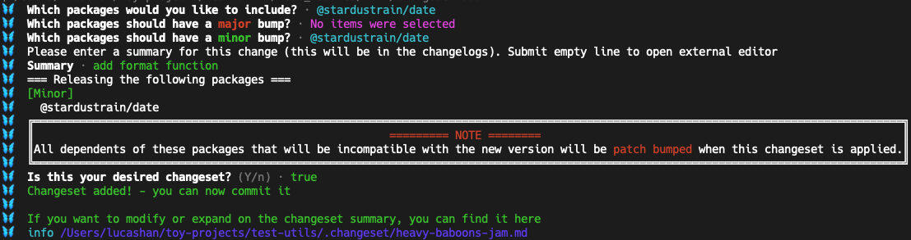
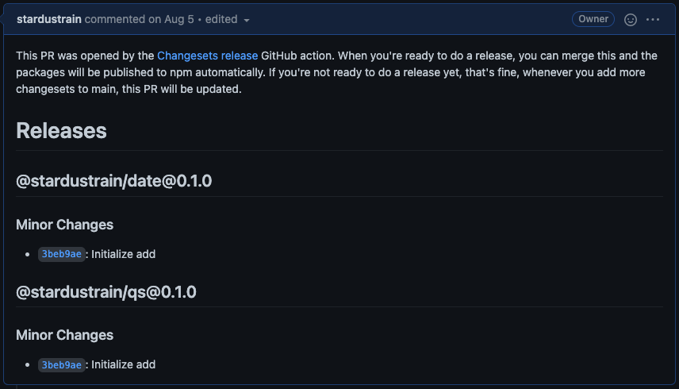
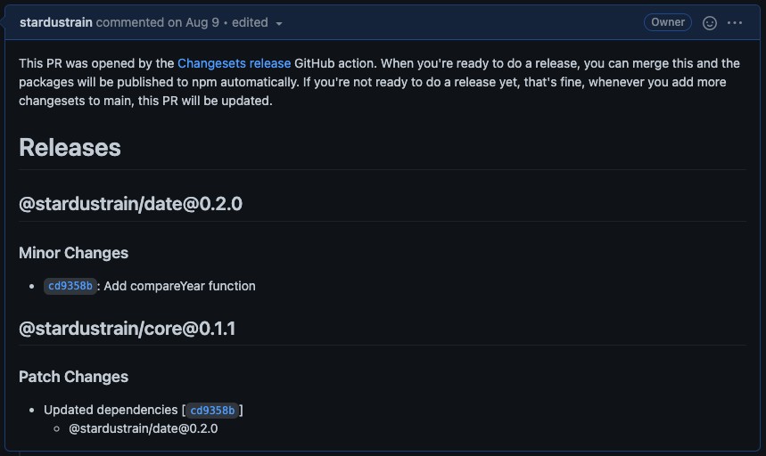

[이전 글](/programming/setting-monorepo-for-github-npm-registry-1/)에서 monorepo를 구성하는 기본적인 내용을 다뤘다면, 이번 글에서는 `changesets`를 이용한 각 패키지의 배포 관리 방법을 소개하고자 한다.

## 1. Changesets?

`Changesets`는 muti-package 레포지토리 내에서 패키지 간의 변경과 의존성을 자동으로 관리해주고 배포를 도와주는 툴이다. 특히 [semver bump type](https://semver.org/)으로 버전을 관리하고 있다면 최적의 선택이라고 생각한다. 개인적으로 사용해 보면서 정말 편하다고 느꼈고, 많은 부분을 알아서 처리해 주기 때문에 잘만 설정한다면 패키지 배포에는 크게 신경 쓰지 않아도 괜찮을 정도이다. 실제로 팀의 디자인 시스템 레포지토리에 한 달 정도 기여하며 느낀 장점은 대략 아래와 같다.

1. 자동으로 바뀐 패키지를 추적해준다. 패키지 간 내부 종속성이 걸려있는 경우도 알아서 처리해주며 특히 바뀐 패키지만 배포하기 때문에 유용하다.
2. 각 패키지의 change log, tagging, versioning, 배포 등 대부분을 자동으로 처리해준다. 특히 `package.json`의 version property 같은 놓치기 쉬운 사소한 부분을 사람이 신경 쓸 필요가 없다는 것이 너무 좋았다.
3. `@changesets/cli`를 통해 일정한 규칙으로 패키지를 관리할 수 있어 일관성 있게 레포지토리를 관리할 수 있고, GitHub Actions 역시 지원하기 때문에 CD pipeline을 구축하기도 편하다.

## 2. Changesets 설정하기

Project root에 `@changesets/cli`를 설치하고 `changeset init` command를 실행한다.

```bash
$ yarn add @changesets/cli -W
$ yarn changeset init
```

문제없이 실행되었다면 project root에 `.changeset` directory가 추가되고, 내부에 `config.json`과 readme 파일이 있는 것을 확인할 수 있다. `baseBranch`설정을 제외하면 `config.json`의 초기 설정을 건드릴 일은 크게 없으며 각 옵션의 확인은 [이곳](https://github.com/atlassian/changesets/blob/main/docs/config-file-options.md)을 참고하면 된다. `baseBranch`는 `main`으로 설정하면 된다.

## 3. GitHub actions 설정하기

GitHub actions를 만들기 전에 필요한 것들을 준비한다. 필요한 것은 npm scripts, GitHub personal access token이다.

### 1. npm scripts

CD pipeline에서 필요한 것은 npm 패키지를 설치하고 각 패키지를 빌드하는 것이다. 이에 따라 필요한 npm scripts를 project root의 `package.json`에 추가한다. 이 부분은 회사의 규칙을 따르거나 개인의 취향대로 설정하면 된다.

```json
{
  "scripts": {
    "boot": "yarn --frozen-lockfile && yarn bootstrap",
    "bootstrap": "yarn lerna:bootstrap",
    "lerna:bootstrap": "lerna bootstrap --use-workspaces",
    "build": "lerna run build --stream",
    "build:packages": "yarn build",
    "release": "changeset publish"
  }
}
```

그리고 date, qs 패키지의 `package.json`에 배포와 관련하여 다음의 설정을 추가한다. 각 property에 대한 자세한 설명은 [이곳](https://docs.npmjs.com/cli/v7/configuring-npm/package-json)을 참고하면 된다.

```json
{
  "name": "@{USER_NAME}/{PACKAGE_NAME}",
  "files": ["dist"],
  "publishConfig": {
    "registry": "https://npm.pkg.github.com/"
  },
  "repository": {
    "directory": "packages/{PACKAGE_NAME}",
    "type": "git",
    "url": "git+https://github.com/{USER_NAME}/{REPOSITORY_NAME}.git"
  }
}
```

### 2. GitHub PAT

일단 GitHub npm registry에 배포할 것이기 때문에 `write:package` 권한이 포함된 personal access token을 발급받는다. 정상적으로 발급이 되었다면 레포지토리의 secrets에 적당한 key 값으로 token을 넣어준다(예시에서는 `NPM_REGISTRY_TOKEN`이라는 이름을 사용했다). Project root에 `.npmrc` 파일을 생성하고 다음과 같이 입력한다.

```
//npm.pkg.github.com/:_authToken=${NPM_REGISTRY_TOKEN}
@{USER_NAME}:registry=https://npm.pkg.github.com/
```

`USER_NAME` 부분에는 자신의 GitHub name을 쓰면 된다.

### 3. GitHub actions

그리고 project root에 `.github/workflows/release.yml` 파일을 만들고 다음의 내용을 입력한다.

<details>
  <summary>release.yml</summary>

```yml
name: Release

on:
  push:
    paths:
      - '.changeset/**'
      - 'packages/**'
    branches:
      - main

jobs:
  release:
    name: Release
    runs-on: ubuntu-latest
    steps:
      - name: Checkout Repository
        uses: actions/checkout@v2
        with:
          fetch-depth: 0

      - name: Setup Node.js
        uses: actions/setup-node@v2
        with:
          node-version: '14'

      - name: Fix .npmrc
        run: sed -i 's/\${NPM_REGISTRY_TOKEN}/'"${NPM_REGISTRY_TOKEN}"'/' .npmrc
        env:
          NPM_REGISTRY_TOKEN: ${{ secrets.NPM_REGISTRY_TOKEN }}

      - name: Install Dependencies
        run: yarn boot

      - name: Build packages
        run: yarn build:packages

      - name: Create release Pull request or Publish npm
        id: changesets
        uses: changesets/action@master
        with:
          publish: yarn release
          commit: 'chore(release): version packages'
          title: 'chore(release): version packages'
        env:
          GITHUB_TOKEN: ${{ secrets.GITHUB_TOKEN }}
```

</details>

이렇게 하면 필요한 준비는 어느 정도 마무리된 것이다.

## 4. Changesets 으로 배포 하기

### 1. 그럴듯한 함수를 만들어보자

각 패키지에 배포할만한, 그럴듯한 함수를 하나씩 만들어보자. date 패키지에는 `date-fns`를 설치할 것이다.

```bash
$ yarn workspace @{USER_NAME}/date add date-fns
```

설치되었다면 각 패키지의 index.ts에 각각 함수를 작성한다.

```ts
// qs/src/index.ts
type ValueFromQueryString = string | number | boolean
export const getQueryString = (queryObject: { [key: string]: ValueFromQueryString }) =>
  Object.entries(queryObject)
    .map(([key, value]) => `${key}=${value}`)
    .join('&')

// date/src/index.ts
import { format as dateFnsFormat } from 'date-fns'

const DEFAULT_FORMAT = 'yyyy-MM-dd HH:mm'
export const format = (date = new Date(), formatString?: string) =>
  dateFnsFormat(date, formatString ?? DEFAULT_FORMAT)
```

### 2. Changesets에 바뀐 패키지를 알려주자

Changesets가 바뀐 패키지를 배포하려면 `.changeset` directory 하위에 change log를 쌓아야 한다. 이렇게 만들어지는 change log를 *changeset*이라고 부른다. 이를 위해서 다음의 command를 실행한다.

```bash
$ yarn changeset add
```

정상적으로 실행되었다면 어떤 패키지의 변경을 다음 배포에 포함할 것인지 물어본다. 모든 패키지를 선택해도 상관없지만, 나중에 change log의 관리를 위해 각 패키지의 changeset을 따로 저장하기로 한다. date 패키지만 선택하고 단순한 util function이 하나 추가된 것이니 minor 버전을 올린다. 물론 major 버전을 올려도 상관없으며, 팀의 버전 컨벤션을 따르거나 본인만의 기준을 편하게 따르면 된다. 그리고 변경된 부분을 간단히 기록한다.

<center>
  
</center>

잘 실행되었다면 `.changeset` 하위에 무작위로 생성된 이름을 가진 changeset이 markdown 형태로 만들어진다. 생성된 changeset은 나중에 패키지가 배포될 때 삭제되니 걱정하지 않아도 된다.

```md
---
'@{USER_NAME}/date': minor
---

add format function
```

qs 패키지도 마찬가지의 과정을 거쳐서 changeset을 생성한다. 생성된 파일의 내용이 이상 없다면, 이 상태로 commit하고 레포지토리에 push 한다.

### 3. 배포하기

해당 commit이 push되면 actions가 실행된다. main branch에 changeset이 있기 때문에 actions가 정상적으로 실행을 마치면 release.yml에 설정한 대로 `chore(release): version packages`라는 이름의 pull request가 자동으로 생성된다.

<center>
  
</center>

자동으로 생성된 pull request의 내용을 확인해보면 `.changeset` directory 하위의 changeset을 기반으로 해당 pull request가 생성되었음을 알 수 있다. 이제 이 pull request를 merge하면, 위의 패키지는 배포된다.

배포가 완료되면 배포가 된 패키지만 CHANGELOG.md가 업데이트되고, tagging 된다. 이는 레포지토리와 GitHub actions의 log를 보면 쉽게 확인할 수 있다.

```bash
/usr/local/bin/yarn release
yarn run v1.22.11
$ changeset publish
🦋  info npm info @{USER_NAME}/date
🦋  info npm info @{USER_NAME}/qs
🦋  info @{USER_NAME}/date is being published because our local version (0.1.0) has not been published on npm
🦋  info @{USER_NAME}/qs is being published because our local version (0.1.0) has not been published on npm
🦋  info Publishing "@{USER_NAME}/date" at "0.1.0"
🦋  info Publishing "@{USER_NAME}/qs" at "0.1.0"
🦋  success packages published successfully:
🦋  @{USER_NAME}/date@0.1.0
🦋  @{USER_NAME}/qs@0.1.0
🦋  Creating git tags...
🦋  New tag:  @{USER_NAME}/date@0.1.0
🦋  New tag:  @{USER_NAME}/qs@0.1.0
```

### 4. Internal dependency

chakra ui의 `chakra-ui/react` 패키지처럼 [단순히 다른 패키지들을 export만 하는 패키지](https://github.com/chakra-ui/chakra-ui/blob/main/packages/react/src/index.tsx)가 필요한 경우도 있다. 여기서는 `core`라는 이름(어떤 이름이 좋을지 잘 떠오르지 않는다)으로 그런 역할을 하는 패키지를 만들어 보도록 한다. 먼저 `packages` directory 아래에 `core`라는 패키지를 만들고 tsconfig.json과 package.json을 설정한다. 그리고 다른 패키지를 의존성에 추가해준다.

```bash
$ yarn lerna add @{USER_NAME}/qs --scope=@{USER_NAME}/core
$ yarn lerna add @{USER_NAME}/date --scope=@{USER_NAME}/core
```

이렇게 하면 project root의 node_modules에 패키지가 추가되고 symlink 형태로 각 패키지를 참조하게 된다. 여기까지 확인했다면 `core/index.ts`에서 단순히 각 패키지를 export 하게끔 만든다.

```ts
// core/src/index.ts
export * from '@{USER_NAME}/date'
export * from '@{USER_NAME}/qs'
```

그리고 동일한 과정을 거쳐 core 패키지를 배포한다. 현재 core 패키지는 date와 qs 패키지를 의존하고 있는 상태인데, 만약 이 상황에서 date 혹은 qs 패키지의 내용이 바뀌면 어떻게 될까? 일단 date 패키지에 간단한 함수를 하나 더 추가한다.

```ts
// date/src/index.ts
import { format as dateFnsFormat, compareAsc, getMonth } from 'date-fns'

export const compareMonth = (...dates: Date[]) =>
  dates.sort((dateA, dateB) => compareAsc(getMonth(dateA), getMonth(dateB)))
```

date 패키지 역시 동일한 과정으로 changeset을 만들어 commit하고 main branch에 push 하면 자동으로 `chore(release): version packages` pull request가 생성된다. 이 pull request의 내용을 확인해보면,

<center>
  
</center>

core 패키지의 patch 버전을 자동으로 올려준 것을 확인할 수 있다. Patch 버전이 증가한 것은 `.changeset/config.json`에 `updateInternalDependencies: patch`로 설정되어있기 때문이다. Pull request의 file changed를 살펴보면 core 패키지의 `package.json`의 version과 dependencies에 선언되어있는 date 패키지의 버전이 수정된 것을 확인할 수 있다.

```diff-json
{
-  version: "0.1.0",
+  version: "0.1.1",
  dependencies: {
-   "@{USER_NAME}/date": "0.1.0",
+   "@{USER_NAME}/date": "0.2.0",
    "@{USER_NAME}/qs": "0.1.0"
  }
}
```

마찬가지로, 해당 pull request를 merge 하면 바뀌지 않은 qs 패키지를 제외한 두 패키지가 npm registry에 배포된다.

## 5. Conclusion

`Changesets`를 통해 monorepo의 패키지를 관리하는 순서는 다음과 같이 정리할 수 있다.

1. 코드 작업을 한다.
2. `changeset add` command를 실행하고 changeset을 만든다.
3. 작업한 코드와 changeset을 함께 commit 한다.
4. 레포지토리에 push 하면 changeset actions가 자동으로 pull request를 만들어준다.
   - 각 패키지의 CHANGELOG.md와 package.json의 version property가 변경되어 file changed에 포함된다. 생성된 모든 changeset들은 삭제되어 file changed에 포함된다.
   - A 패키지가 B 패키지에 의존하고 있는 상황에서 B 패키지의 버전이 변경되면, 자동으로 A 패키지의 버전과 dependency가 업데이트되어 file changed에 포함된다.
5. Changeset이 적당히 모인 시점에 changeset actions가 만들어 놓은 pull request를 merge 하면 그간의 변경들이 npm registry에 배포된다.
6. 배포되면 actions가 배포된 패키지를 tagging하고 마무리된다.

복잡해 보이지만 그렇게까지 복잡하지 않은 과정이며, 직접 레포지토리를 만들어 테스트해보면 금방 이해할 수 있다. `Changesets`은 많은 부분을 자동으로 처리해주고 있고 사소한 부분까지 잘 커버하고 있기 때문에 굉장히 편하다는 느낌을 많이 받았다. Monorepo로 패키지를 관리하고 있을 때 별도의 배포 과정이 필요하지 않고 단순히 npm registry에 패키지를 배포해야한다면 `changesets`는 좋은 선택 중 하나일 거라고 생각한다.

---

<h2 class="reference-title">참고</h2>

- [chakra-ui contributing guide](https://github.com/chakra-ui/chakra-ui/blob/main/CONTRIBUTING.md)
- [changesets](https://github.com/atlassian/changesets)
