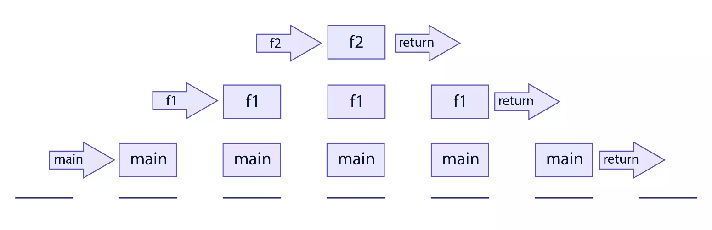

## 1. 재귀 함수란?

재귀 함수란 자기 자신을 호출하는 함수이다. 보통은 똑같은 로직이 반복적으로 필요한 문제를 분할정복(divide-and-conquer) 하기 위해 사용한다. 또한 loop를 내장하지 않은 언어로 개발하게 되는 경우에도 많이 사용하게 된다.

재귀 함수를 작성할 때 중요한 것은 **탈출 조건을 명시**하는 것이다. 함수의 호출을 멈출 수 있는 조건을 명시하지 않는다면 무한히 자기 자신을 호출하게 되어, stack overflow가 발생하게 된다.

그럼에도 불구하고 이런 부분만 주의한다면 일반적인 loop 로직을 작성할 때 보다 더 가독성이 좋은 코드를 작성할 수도 있다.

## 2. Factorial 예제

재귀 함수의 사용법은, 익히 알고 있는 가장 간단한 예시를 들어보면 이해하기 쉽다. 주로 재귀 함수를 다룰 때 예제로 많이 나오는 문제인 factorial을 계산하는 로직을 작성해 보면 좋다.

Factorial의 사전적인 정의는 그 수보다 적거나 같은 모든 양의 정수의 곱으로, 쉽게 말하자면 1부터 계산의 대상이 되는 숫자까지 곱한 것을 의미한다. 즉, `4!`는 4 \* 3 \* 2 \* 1 = 24로 계산할 수 있다.

늘 그렇듯 Factorial 함수를 만드는 방법은 여러 가지가 있다. 여기서는 Loop를 이용한 방법부터 재귀 함수를 거쳐 꼬리 재귀 기법을 적용한 함수까지 다시 작성해 보면서 각 로직을 비교해 보고자 한다.

### 1. Loop

먼저, `for` 문을 이용한다면 다음과 같이 작성할 수 있다.

```typescript
const factorial = (value: number) => {
  let result = 1

  for (let i = 1; i <= value; i++) {
    result *= i
  }

  return result
}
```

혹은 `reduce`를 사용하는 방법도 있다.

```typescript
const factorial = (value: number) => {
  return Array.from({ length: value }).reduce((acc, _, index) => acc * (index + 1), 1)
}
```

간단한 로직이지만 함수가 어떤 일을 하는지 따라가며 읽어야 하는 약간의 불편함이 존재한다.

### 2. 재귀 함수

같은 로직을 재귀 함수로 작성한다면 다음과 같이 작성할 수 있다.

```typescript
const factorial = (value: number) => {
  if (value === 1) {
    return value
  }

  return value * factorial(value - 1)
}
```

생각보다 간단하다. value가 1이라면 바로 1을 반환하고, 그렇지 않다면 value와 value에서 1을 뺀 다음 다시 자기 자신을 호출하여 반환된 값을 곱한다. 어떻게 생각해 보면 `factorial(4)`를 호출했을 때 `4 * 3 * 2 * 1`로 계산되는 수식을 함수로 옮겼다고 볼 수도 있을 것 같다.

그런데 만약 factorial(4)이 호출된다면 실제로 어떻게 실행될까?

## 3. 함수 호출과 call stack

### 1. 우리가 작성한 함수는 어떻게 호출될까?

일반적인 경우 우리가 작성한 코드는 사람이 이해할 수는 있지만 컴퓨터는 이해할 수 없기 때문에 기계어로 바꾸어 주어야 하는데 보통 이 과정을 *컴파일*이라고 한다.

컴파일된 코드는 SSD, HDD 같은 저장장치에 보관되고 있다가, 프로그램이 실행되면 OS가 해당 코드를 메모리로 로드한다. 메모리에 로드된 코드는 필요에 따라 CPU에 의해 연산 되고, 실행된다. 이것이 일반적으로 우리가 “프로세스”라고 불리는 프로그램의 단위가 실행되는 절차이다.

이때, 작성한 코드는 기계어로 변환되어 메모리의 text segment라고 불리는 영역에 로드되고, 프로그램이 동작하는 데 필요한 각종 변수, 배열 등의 정보는 data segment에 로드된다.

OS는 프로세스 실행에 필요한 메모리 영역을 더 할당하게 되는데, 바로 stack segment와 heap segment이다. 두 segment는 역할이 조금 다른데, heap segment는 동적으로 메모리를 할당하기 위해 존재한다. 예를 들면 user의 정보를 DB에서 조회한다고 했을 때, 얼마나 조회될지 알 수 없기 때문에(메모리를 얼마나 사용할지 알 수 없기 때문에) 동적으로 메모리에 할당할 수밖에 없다.

Stack segment는 함수의 stack frame, 즉 함수에서 사용되는 매개변수, 지역변수, 함수 실행이 끝나는 시점까지 저장해야 하는 정보를 저장한다. stack이라는 이름처럼, 말 그대로 연속된 메모리 주소를 점유하는 stack 자료구조이며 필요에 따라 늘어나고 줄어들지만, 사용할 수 있는 메모리 공간은 제한되어 있다.

프로세스에서 특정 함수가 호출되면 함수의 stack frame이 stack segment에 쌓이게 되어 FILO 형태로 관리 됩니다. 즉, 가장 먼저 호출된 함수는 가장 늦게 stack에서 사라지게 됩니다. 예를 들어, 다음과 같은 함수가 있을 경우 stack segment에서 다음과 같이 관리된다.

```typescript
function f2() {
  return
}

function f1() {
  f2()
  return
}

function() main {
  f1()
}

main()
```

<center>
  <figure>
     <figcaption style="font-size: 14px;">
      - 출처: <a href="https://www.scaler.com/topics/c/c-function-call-stack/" rel="noopener noreferrer" target="_blank">Function Call Stack</a>
    </figcaption>
  </figure>
</center>

### 2. 재귀 함수와 call stack

그렇다면 재귀함수가 호출될 경우 stack segment에는 어떤 형태로 stack frame이 쌓이게 될까? 위의 예제와 함께 생각해 보면 좋을 것 같다. 먼저, `factorial(4)`를 호출하게 되면 함수는 어떤 형태로 평가될까?

```typescript
const factorial = (value: number) => {
  if (value === 1) {
    return value
  }

  return value * factorial(value - 1)
}

factorial(4)

// Function evaluation process
// append
4 * factorial(3)
4 * (3 * factorial(2))
4 * (3 * (2 * factorial(1))
// pop
4 * (3 * (2 * 1))
4 * (3 * 2)
4 * 6
// 24
```

함수는 가장 안쪽의 값부터 평가하기 때문에, 위와 같은 형태로 연산이 될 거라 예상할 수 있다. 그렇다면 만약, call stack에 해당 재귀 로직의 stack frame이 쌓이는 형태를 간단히 표현해 본다면 어떻게 될까? 아마 아래와 같을 것이다.

<center>
  <figure>
    
  </figure>
</center>

가장 먼저 호출된 factorial(4) 함수는 위에 쌓인 stack frame이 전부 pop 될 때까지 return 되지 않는다. 즉, factorial(3)부터 factorial(1)이 모두 실행될 때까지 stack segment의 메모리를 점유하고 있어야 한다는 뜻이다. 만약 함수 하나의 연산이 오래 걸린다거나 큰 숫자를 연산해야 한다면 어떻게 될까?

재귀 함수는 다음과 같은 경우에도 문제가 생길 여지가 있다. 이번에는 피보나치수열을 만드는 함수를 예시로 들어보겠다.

```typescript
const fibonacci = (limit: number) => {
  if (limit < 1) {
    throw new Error('limit should be greater than or equal to 1')
  }

  if (limit === 1 || limit === 2) {
    return limit - 1
  }

  return fibonacci(limit - 1) + fibonacci(limit - 2)
}
```

위 함수를 이용해 fibonacci(4)를 호출했을 때의 stack frame을 간단히 표현해 보자면 아래와 같을 것이다.

<center>
  <figure>
    
  </figure>
</center>

재귀 호출이 되는 부분에서 fibonacci(2)가 두 번 연산 되고 있다. 사실상 동일한 결과를 반환하는 연산을 두 번 반복하게 되는 셈이며, 이 역시 연산 숫자가 커지면 문제가 될 수 있다.

## 4. 꼬리 재귀 함수로 다시 작성하기

### 1. 꼬리 재귀 함수란?

다행히 이런 문제를 회피하면서 재귀 함수를 작성할 방법이 있다. 바로 꼬리 재귀(tail recursion) 기법이다. 꼬리 재귀란, 반환되는 대상이 호출하는 주체와 동일한 서브루틴인 경우를 의미한다. 쉽게 코드로 표현하자면 아래와 같다.

```typescript
const factorial = (acc: number, value: number) => {
  if (value === 1) {
    return acc
  }

  return factorial(acc * value, value - 1)
}
```

위의 재귀 함수들과는 다르게, 반환하는 대상은 정확히 자기 자신이다. 이 함수로 factorial(4)를 호출하게 되면 다음과 같이 동작한다.

```typescript
factorial(1, 4)

// Function evaluation process
// append
factorial(1, 4)
// pop, append
factorial(4, 3)
// pop, append
factorial(12, 2)
// pop, append
factorial(24, 1)
// pop
// 24
```

즉, 일반적인 재귀 호출과는 다르게 먼저 실행된 함수가 평가될 때까지 기다릴 필요가 없다. 이 말은, 맨 처음 호출된 factorial(1, 4)는, 맨 마지막에 호출되는 factorial(24, 1)의 결과가 반환될 때까지 기다릴 필요가 없다는 뜻이다. 이렇게 구현된 함수는 호출되자마자 call stack에서 stack frame이 pop 될 수 있다는 뜻과도 동일하며, 결국 하나의 stack frame만을 점유하면서 일반 재귀함수와 동일한 연산을 할 수 있게 된다.

### 2. 함수와 call stack을 연관지어 생각해보기

함수를 호출할 때, 함수의 파라미터, 반환 값, 반환 값과 함께 돌아갈 위치값을 call frame에 담아 call stack에 저장한다. 일반적인 재귀 함수로 작성한 factorial의 경우 n \* factorial(n - 1)를 반환하는 시점에서 먼저 실행한 factorial 함수가 종료되지 않은채로 해당 로직을 실행하고, 그 결과와 함께 호출된 위치로 돌아가야 한다. 즉 함수가 끝나지 않은 채(call stack에서 pop 되지 않은 채) 연속적으로 함수를 호출하게 되어 call stack에 메모리가 쌓이게 되는 것이다. 이렇게 된다면 탈출 조건을 잘 명시하더라도 stack overflow가 일어나게 된다.

하지만 꼬리 재귀로 작성하게 되면 값을 반환하더라도 연산할 필요가 없이 단순히 함수만 호출하게 되기 때문에 결과와 함께 호출된 위치로 돌아갈 필요가 없다. 즉, 최종적으로 연산된 값을 반환하기 위해 함수가 처음 호출된 위치의 메모리 주소만 알고 있으면 된다.

### 3. 주의사항

많은 현대의 언어들이 컴파일러 레벨에서 tail recursion을 지원하지만, JavaScript는 제약이 존재한다. ES6의 공식 스펙으로 지정되었지만 아쉽게도 현재는 [사파리만 지원](<https://kangax.github.io/compat-table/es6/#test-proper_tail_calls_(tail_call_optimisation)>)하는 것으로 보인다.

---

<h2 class="reference-title">참고</h2>

- [Recursion and Memory Visualization](https://www.educative.io/courses/recursion-for-coding-interviews-in-python/recursion-and-memory-visualization)

- [ECMAScript 6 compatibility table](<https://kangax.github.io/compat-table/es6/#test-proper_tail_calls_(tail_call_optimisation)>)

- [What happened to proper tail calls in JavaScript?](https://world.hey.com/mgmarlow/what-happened-to-proper-tail-calls-in-javascript-5494c256)
